## Chapter 1 : Introduction to HTML and CSS

### Introduction

### HyperText Markup Language (HTML)

- Syntax

  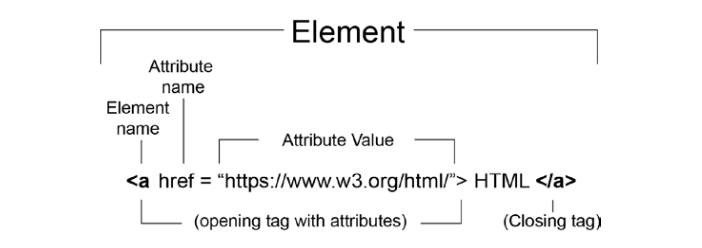

  ```html
  <!-- HTML -->
  <h1>HTML</h1>
  <p>
    HyperText Markup Language (HTML) is a markup language used to describe the
    structure of a web page.
  </p>
  <p>
    We can use it to differentiate such content as:
  </p>
  <ul>
    <li>headings</li>
    <li>lists</li>
    <li>links</li>
    <li>images</li>
  </ul>
  <p>
    Want to
    <a href="https://www.packtpub.com/web-development"
      >learn more about web development?</a
    >
  </p>
  ```

- Content Types

  ```
  Metadata
  Flow
  Sectioning
  Phrasing
  Heading
  Embedded
  Interactive
  ```

- The HTML Document

  ```html
  <html>
    <head>
      <title>HTML Document structure</title>
    </head>
    <body>
      <div>
        <h1>Heading</h1>
        <p>First paragraph of text.</p>
        <p>Second paragraph of text.</p>
      </div>
    </body>
  </html>
  ```

- The HTML DOM

  ```js
  <script>
    const anchorElement = document.createElement('a'); anchorElement.href = '#';
    anchorElement.textContent = 'Click me!'; const p =
    document.querySelector('.parent'); p.appendChild(anchorElement);
  </script>
  ```

- The Doctype Declaration
  ```html
  <!DOCTYPE html>
  ```

### Structuring an HTML Document

- HTML
  ```html
  <!DOCTYPE html>
  <html lang="en"></html>
  ```
- Head

  ```html
  <!DOCTYPE html>
  <html lang="en">
    <head>
      <title>Page Title</title>
    </head>
  </html>
  ```

- Body

  ```html
  <!DOCTYPE html>
  <html lang="en">
    <head>
      <title>Page Title</title>
    </head>
    <body></body>
  </html>
  ```

- Our First Web Page
- _Exercise 1.01: Creating a Web Page_

  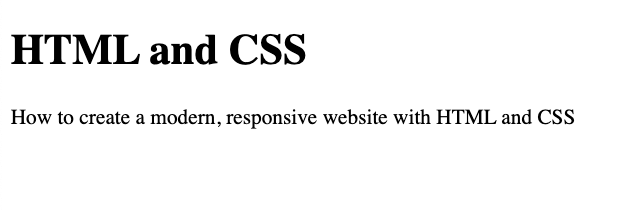

- Metadata

  ```html
  <base href="http://www.example.com" />
  <link rel="stylesheet" href="/style.css" />

  <meta charset="utf-8" />

  <meta name="viewport" content="width=device-width, initial-scale=1" />
  ```

- Exercise 1.02: Adding Metadata

  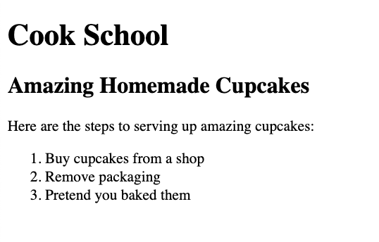

### Mistakes in HTML

```html
<p>
Learn about <a href="https://www.packtpub.com/web-development">web development</a>. Try out some of the <a href="https://www.packtpub.com/free-learning">Free learning on the Packt site.
</p> <p>
Lorem ipsum... </p>
```

```html
<body>
  <main id="main1"><!-- main content here ... --></main>
  <main id="main2"><!-- more main content here ... --></main>
</body>
```

```html
<body>
  <main id="main1"><!-- main content here ... --></main>
  <main id="main2" hidden><!-- more main content here ... --></main>
</body>
```

### Validating HTML

```link
https://validator.w3.org/
```

- _Exercise 1.03: Validation_
- _Exercise 1.04: Validation Errors_
- _Activity 1.01: Video Store Page Template_

### CSS

- Syntax
  ```css
  p {
    color: red;
    font-weight: bold;
    text-decoration: underline;
  }
  ```
- CSS Rule Set

  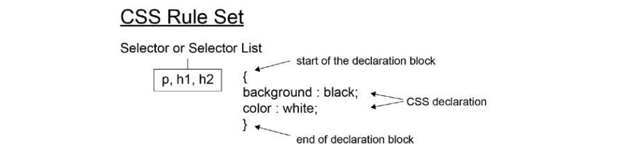

- Adding Styles to a Web Page
- _Exercise 1.05: Adding Styles_

  

- _Exercise 1.06: Styles in an External Fils_

### CSSOM

### CSS Selectors

```css
h1::first-letter {
  font-size: 5rem;
}
p {
  color: white;
  background-color: black;
}
p:nth-of-type(odd) {
  color: black;
  background-color: white;
}
```

- Element, #ID and .Class

  ```css
  .class {
  }
  #id {
  }
  div {
  }
  ```

- The Universal Selectors (\*)

  ```css
  * {
  }
  ```

- Attribute Selectors

  ```css
  [attribute]
  [href]
  [attribute=value]
  [attribute^=value]
  [attribute$=value]
  [attribute*=valule]
  ```

- Pseudo-classes (:)

  ```css
  :link
  :hover
  :visited
  :active
  :first-child
  :last-child
  :nth-child()
  :nth-last-child()
  :first-of-type
  :last-of-type
  :nth-of-type()
  :nth-last-of-type()
  ```

  ```css
  a:link,
  a:visited {
    color: deepskyblue;
    text-decoration: none;
  }
  a:hover,
  a:active {
    color: hotpink;
    text-decoration: dashed underline;
  }
  ```

- Pseudo-elements (::)

  ```css
  ::before
  ::after
  ::first-letter
  ::first-line
  ::selection
  ::backdrop
  ```

- Combining Selectors

  ```css
  .primary li.primary;
  ```

- _Exercise 1.07: Selecting Elements_

  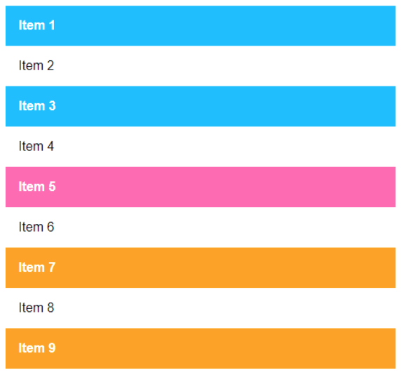

### CSS Specificity

### The Special Case of `!important`

```css
/* CSS */
div.media {
  display: block;
  width: 100%;
  float: left;
}
.hide {
  display: none;
}
```

```html
<!-- HTML -->
<div class="media hide">
  ...Some content
</div>
```

```css
.hide {
  display: none !important;
}
```

- _Activity 1.02: Styling the Video Store Template Page_

### Dev Tools

- The Top Bar

  ```
  Console
  Elements ***
  Sources
  Network
  Performance
  ```

- The Element Tap

# Chapter 2: Structure and Layout

## Introduction

## Structural Elements

```html
<header></header>
<nav></nav>
<article></article>
<section></section>
<aside></aside>
<footer></footer>
```

### The header Tag

```html
<header>
  ... heading, logo, nav goes here
  <header></header>
</header>
```

### The footer Tag

```html
<footer>
  ... copyright, list of links go here
  <footer></footer>
</footer>
```

### The section Tag

```html
<section>
  ... main content
</section>
```

### The article Tag

```html
<article>
  <section>
    ...primary blog content
  </section>
  <section>
    ...secondary blog content
  </section>
</article>
```

### The nav Tag

```html
<navigation> ... list of links go here </navigation>
```

### The aside Tag

```html
<aside>
  ... indirectly related content goes here
</aside>
```

### The div Tag

```html
<div class="sidebar">
  ... indirectly related content goes here
</div>
<div class="navigation">
  <div class="navigation-inner">... navigation links go here</div>
</div>
```

### A News Article Web Page

```a
https://theguardian.com
https://bbc.co.uk/news
```

### _Exercise 2.01: Marking up the Page_

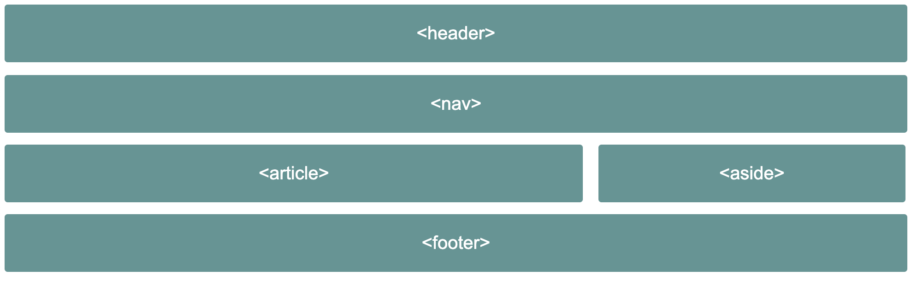

### Wireframes

### _Activity 2.01: Video Store Home Page_

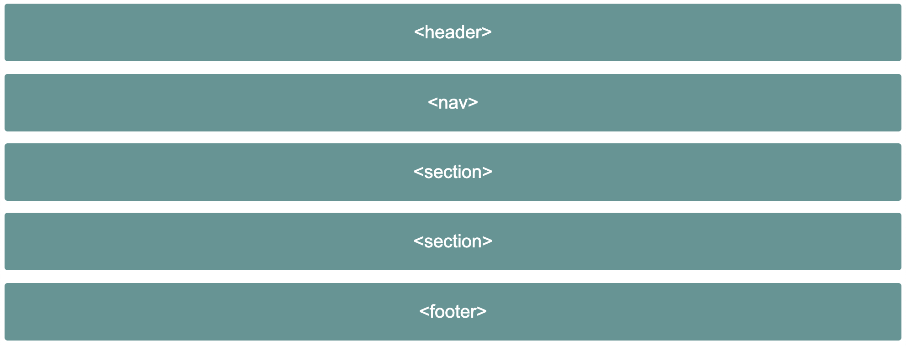

---

## CSS Page Layouts

```css
float
flex
grid
```

### Video Store Product Page

### Float-Based Layout

- The float Property

  ```css
  float: right;
  float: left;
  float: none;
  ```

- the width Property

  ```css
  width: 100px;
  width: 25%;
  ```

- Claring Floated Element

  ```css
  /* CSS */
  section {
    overflow: hidden;
  }
  div {
    float: left;
    width: 25%;
  }
  ```

  ```html
  <!-- HTML -->
  <section>
    <div>product 1</div>
    <div>product 2</div>
    <div>product 3</div>
    <div>product 4</div>
    <div>product 5</div>
    <div>product 6</div>
    <div>product 7</div>
    <div>product 8</div>
  </section>
  ```

### Flex-Based Layout

- The flex Container

  ```css
  display: flex;
  ```

  ```css
  flex-wrap: wrap;
  ```

- The flex Items
  `css flex-basis: 25%;`

  ```html
  <!-- HTML -->
  <section>
    <div>product 1</div>
    <div>product 2</div>
    <div>product 3</div>
    <div>product 4</div>
    <div>product 5</div>
    <div>product 6</div>
    <div>product 7</div>
    <div>product 8</div>
  </section>
  ```

  ```css
  /* CSS */
  section {
    display: flex;
    flex-wrap: wrap;
  }
  div {
    flex-basis: 25%;
  }
  ```

### Grid-Based Layout

- The grid Container

  ```css
  display: grid;
  ```

  ```css
  grid-template-columns: auto auto;
  ```

- The grid Items

### _Exercise 2.02: A grid-Based Layout_

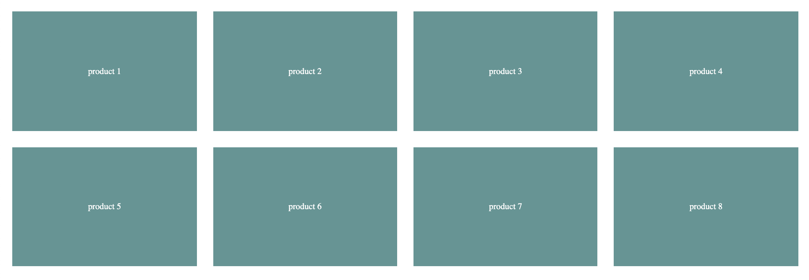

## The Box Model

```css
margin
border
padding
content
width
height
```

### Content Box

```css
width: 200px;
height: 100px;
```

### The padding Property

```css
padding: 50px;
padding: 50px 0;
padding-top: 10px;
padding-right: 10px;
padding-bottom: 10px;
padding-left: 10px;
```

```css
width: 200px;
height: 100px;
padding: 25px;
```

### The border Property

```css
border: 5px solid red;
border-top: 5px solid red;
border-right: 15px dotted green;
border-bottom: 10px dashed blue;
borber-left: 10px double pink;
```

```css
width: 200px;
height: 100px;
padding: 25px;
border: 10px solid black;
```

### The margin Property

```css
margin: 50px;
margin: 50px 0;
margin-top: 10px;
margin-right: 10px;
margin-bottom: 10px;
margin-left: 10px;
```

```css
width: 200px;
height: 100px;
padding: 25px;
border: 10px solid black;
margin: 25px;
```

### _Exercise 2.03: Experimenting with the Box Model_

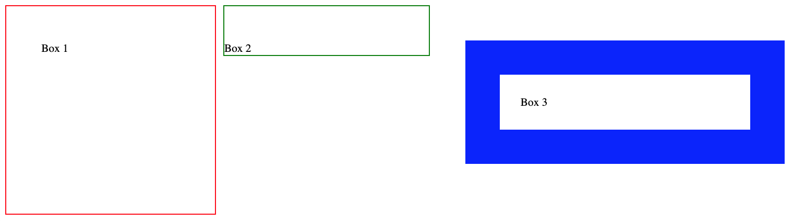

### Putting It All Together

### _Exercise 2.04: Home Page Revisited_

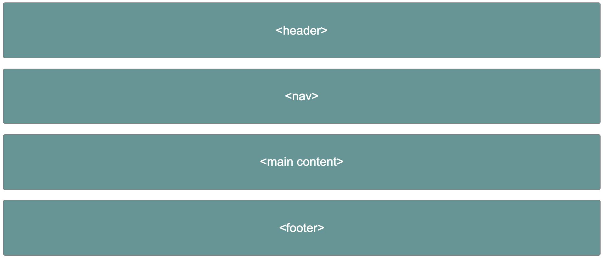

### _Exercise 2.05: Video Store Product Page Revisited_

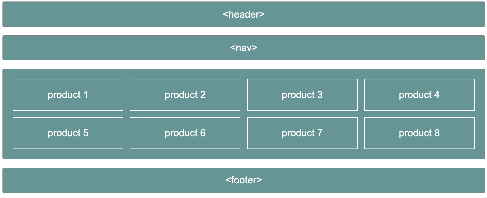

### _Activity 2.02: Online Clothes Store Home Page_

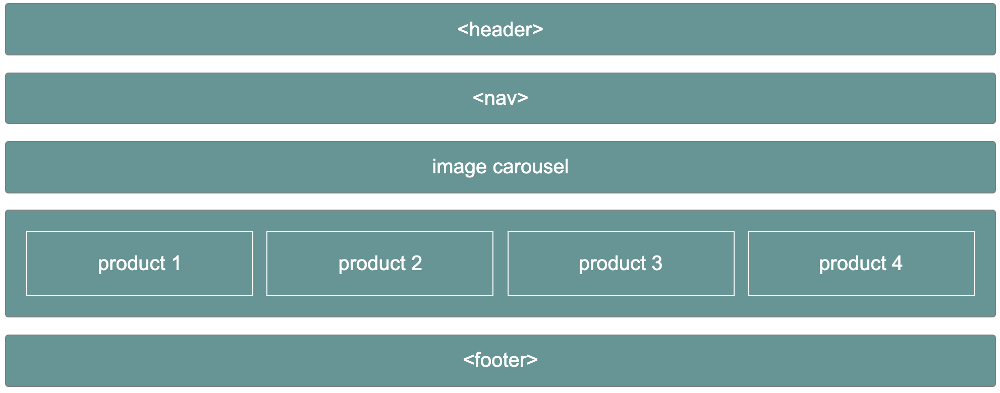

# Chapter 3: Text and Typography

## Table of Contents

[Text-Based Elements](#text-based-element)

- [Heading](#heading)
- [Paragraphs](#paragraph)
- [Inline Text Elements](#inline-text-elements)
- [Lists](#lists)
- [Exercise 3.01: Combining Text-Based Elements](#Exercise-3.01:-Combining-Text-Based-Elements)

[Semantic Markup](#Semantic-Markup)

[Styling Text-Based Elements](#Styling-Text-Based-Elements)

- [CSS Resets](#CSS-Resets)
- [CSS Text Properties](#CSS-Text-Properties)
- [CSS Font Properties](#CSS-Font-Properties)
- [The display Properties](#The-display-Properties)
- [Video Store Product Page (Revisied)](<#Video-Store-Product-Page-(Revisied)>)
- [Exercise 3.02: Navigation](#Exercise-3.02:-Navigation)

[Breadcrumbs](#Breadcrumbs)

- [Exercise 3.03: Breadcrumb](#Exercise-3.03:-Breadcrumb)
- [Exercise 3.04: Page Heading and Introduction](#Exercise-3.04:-Page-Heading-and-Introduction)
- [Exercise 3.06: Putting It All Together](#Exercise-3.06:-Putting-It-All-Together)

## Text-Based Elements

```
- Headings
- Paragraphs
- Inline elements
- Lists
```

- ### Headings

  ```html
  <h1>Heading level 1</h1>
  <h2>Heading level 2</h2>
  <h3>Heading level 3</h3>
  <h4>Heading level 4</h4>
  <h5>Heading level 5</h5>
  <h6>Heading level 6</h6>
  ```

- ### Paragraphs

  ```html
  <p>
    Sit down awhile, And let us once again assail your ears, That are so
    fortified against our story,
  </p>
  ```

- ### Inline Text Elements

  ```html
  <p>I need to wake up <em>now</em>!</p>
  ```

  ```html
  <p>
    Before leaving the house <strong>remember to lock the front door</strong>!
  </p>
  ```

- ### Lists

  ```html
  <!-- Shopping list -->
  <ul>
    <li>Ice Cream</li>
    <li>Cookies</li>
    <li>Salad</li>
    <li>Soap</li>
  </ul>
  ```

  ```html
  <!-- Cheese on toast recipe -->
  <ol>
    <li>Place bread under grill until golden brown</li>
    <li>Flip the bread and place cheese slices</li>
    <li>Cook until cheese is golden brown</li>
    <li>Serve immediately</li>
  </ol>
  ```

  ```html
  <!-- Dictionary -->
  <dl>
    <dt>HTML</dt>
    <dd>Hypertext markup language</dd>
    <dt>CSS</dt>
    <dd>Cascading style sheets</dd>
  </dl>
  ```

- ### _Exercise 3.01: Combining Text-Based Elements_

  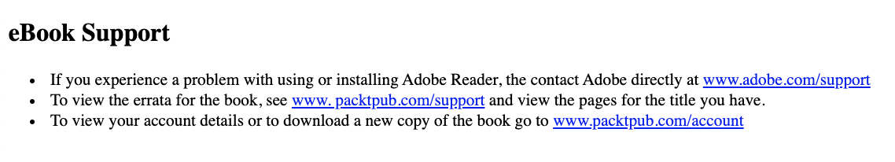

## Semantic Markup

```html
<!-- Semantic markup -->
<h1>I am a top level page heading</h1>
<p>
  This is a paragraph which contains a word with
  <strong>strong</strong> significance
</p>
<!-- Non semantic markup -->
<div>I am a top level page heading</div>
<div>
  This is a paragraph which contains a word with
  <span>strong</span> significance
</div>
```

## Styling Text-Based Elements

- ### CSS Resets

  ```css
  * {
    margin: 0;
    padding: 0;
  }
  ```

  ```css
  /* http://meyerweb.com/eric/tools/css/reset/ v2.0 | 20110126
  License: none (public domain)
  */
  html,
  body,
  div,
  span,
  applet,
  object,
  iframe,
  h1,
  h2,
  h3,
  h4,
  h5,
  h6,
  p,
  blockquote,
  pre,
  a,
  abbr,
  acronym,
  address,
  big,
  cite,
  code,
  del,
  dfn,
  em,
  img,
  ins,
  kbd,
  q,
  s,
  samp,
  small,
  strike,
  strong,
  sub,
  sup,
  tt,
  var,
  b,
  u,
  i,
  center,
  dl,
  dt,
  dd,
  ol,
  ul,
  li,
  fieldset,
  form,
  label,
  legend,
  table,
  caption,
  tbody,
  tfoot,
  thead,
  tr,
  th,
  td,
  article,
  aside,
  canvas,
  details,
  embed,
  figure,
  figcaption,
  footer,
  header,
  hgroup,
  menu,
  nav,
  output,
  ruby,
  section,
  summary,
  time,
  mark,
  audio,
  video {
    margin: 0;
    padding: 0;
    border: 0;
    font-size: 100%;
    font: inherit;
    vertical-align: baseline;
  }
  /* HTML5 display-role reset for older browsers */
  article,
  aside,
  details,
  figcaption,
  figure,
  footer,
  header,
  hgroup,
  menu,
  nav,
  section {
    display: block;
  }
  body {
    line-height: 1;
  }
  ol,
  ul {
    list-style: none;
  }
  blockquote,
  q {
    quotes: none;
  }
  blockquote:before,
  blockquote:after,
  q:before,
  q:after {
    content: "";
    content: none;
  }
  table {
    border-collapse: collapse;
    border-spacing: 0;
  }
  ```

- ### CSS Text Properties

  ```css
  h1 {
    color: green;
  }
  p {
    color: #00ff00;
  }
  span {
    color: rgb(0, 255, 0);
  }
  p {
    text-align: center;
  }
  /* ขีดเส้นใต้หนังสือ */
  .underline {
    text-decoration: underline;
  }
  /* เส้นทับตัวหนังสือ */
  .line-through {
    text-decoration: line-through;
  }
  /* ตัวใหญ่หมด */
  .uppercase {
    text-transform: uppercase;
  }
  /* ตัวเล็กหมด */
  .lowercase {
    text-transform: lowercase;
  }
  /* อักษรตัวแรกใหญ่ */
  .capitalize {
    text-transform: capitalize;
  }
  /* ความชิดของแต่ละบรรทัด น้อย */
  .small-line-height {
    line-height: 0.5;
  }
  /* ความชิดของแต่ละบรรทัด มาก */
  .large-line-height {
    line-height: 1.5;
  }
  ```

- ### CSS Font Properties

  ```css
  body {
    font-family: "Times New Roman", Times, serif;
  }
  /* pixels */
  h1 {
    font-size: 50px;
  }
  p {
    font-size: 16px;
  }
  /* ems */
  h1 {
    font-size: 3.125em;
  }
  p {
    font-size: 1em;
  }
  span {
    font-weight: bold;
  }
  ```

- ### The display Properties

  ```css
  div {
    display: inline;
  }
  span {
    display: block;
  }
  ```

- ### Video Store Product Page (Revisied)

- ### _Exercise 3.02: Navigation_

  

## Breadcrumbs

- ### _Exercise 3.03: Breadcrumb_

  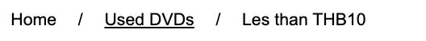

- ### _Exercise 3.04: Page Heading and Introduction_

  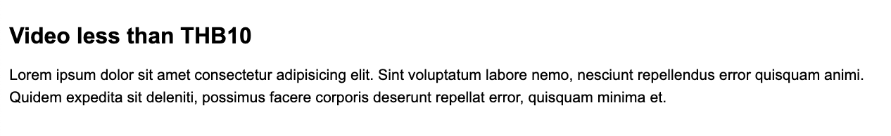

- ### _Exercise 3.05: Product Cards_

  

- ### _Exercise 3.06: Putting It All Together_

  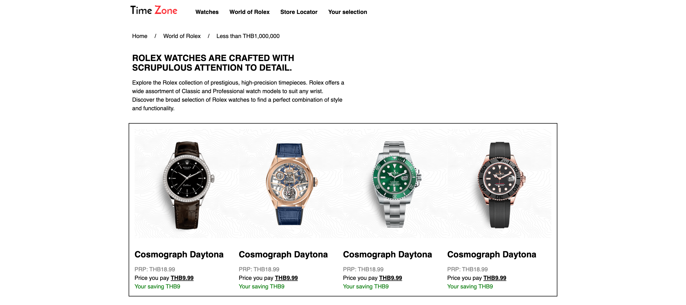

- ### _Activity 3.01: Converting a Newspaper Article to a Web Page_

<!-- CONTACT -->

## Contact

Oat Phattaraphon - [@phattaraphon_c](https://twitter.com/phattaraphon_c)
