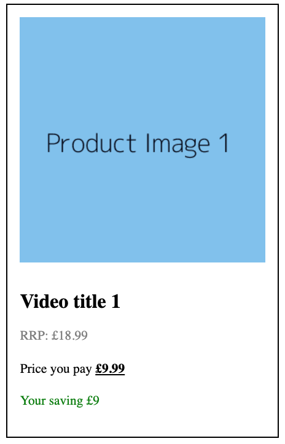
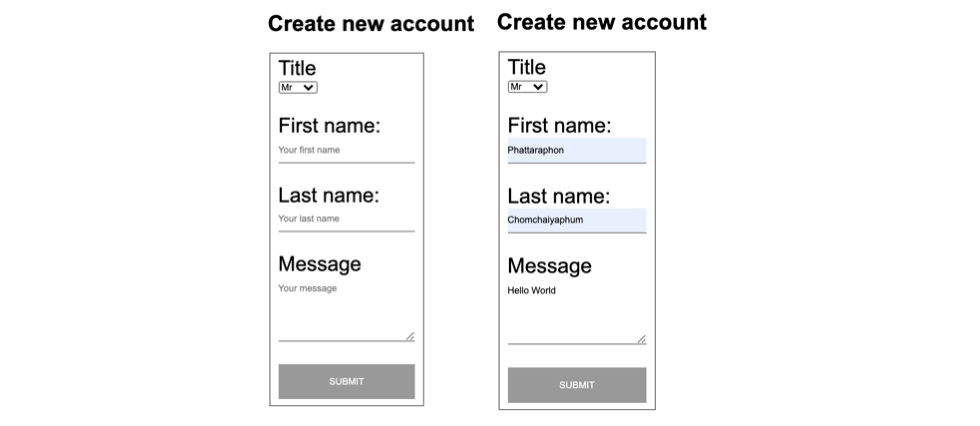
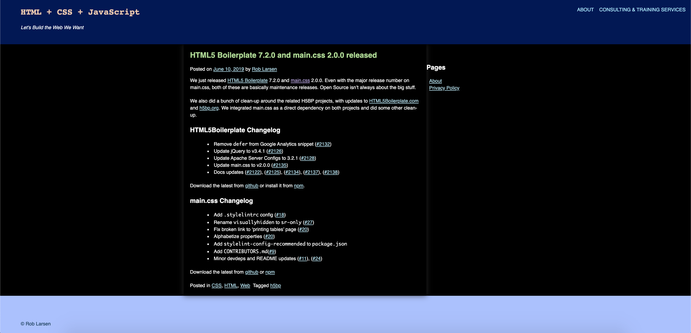
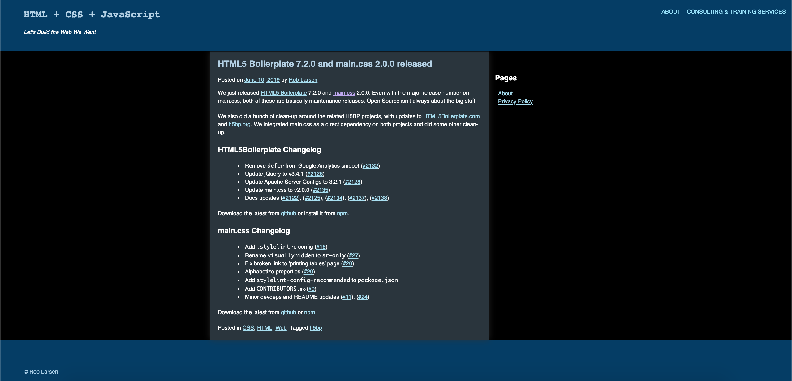
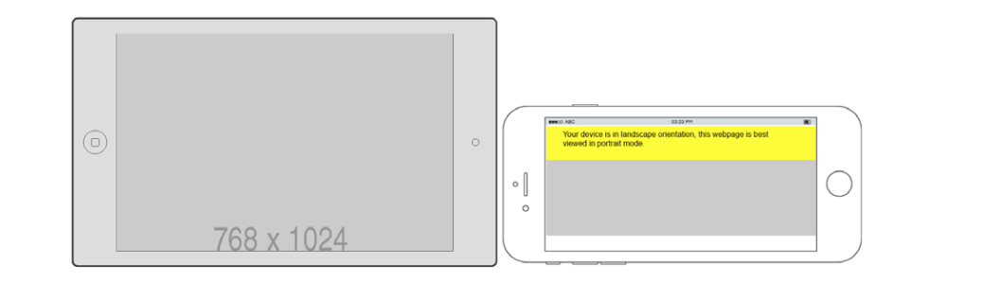
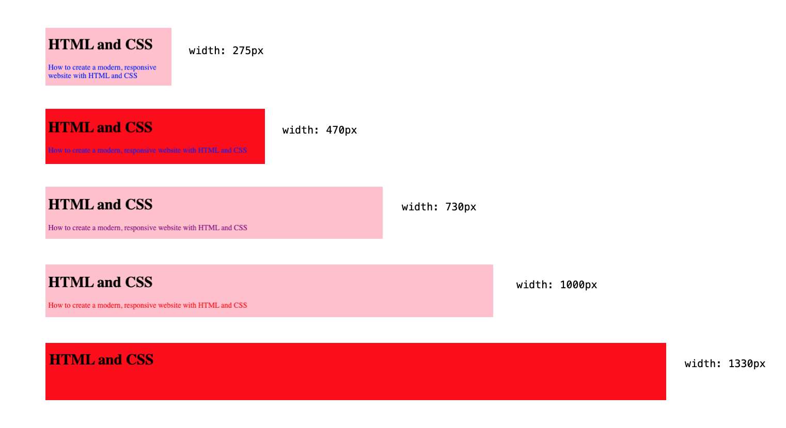
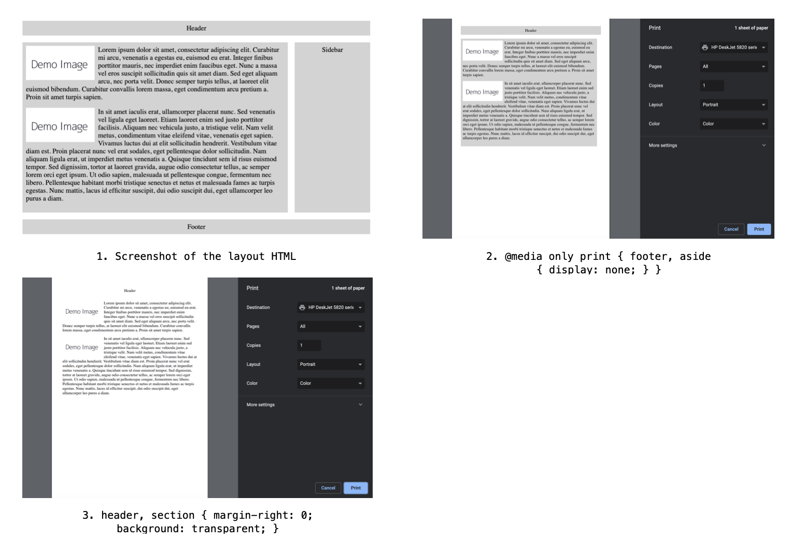

# **Chapter 1 : Introduction to HTML and CSS**

## **HyperText Markup Language (HTML)**

- ### Syntax

  

  ```html
  <!-- HTML -->
  <h1>HTML</h1>
  <p>
    HyperText Markup Language (HTML) is a markup language used to describe the
    structure of a web page.
  </p>
  <p>
    We can use it to differentiate such content as:
  </p>
  <ul>
    <li>headings</li>
    <li>lists</li>
    <li>links</li>
    <li>images</li>
  </ul>
  <p>
    Want to
    <a href="https://www.packtpub.com/web-development"
      >learn more about web development?</a
    >
  </p>
  ```

- ### Content Types

  ```
  Metadata
  Flow
  Sectioning
  Phrasing
  Heading
  Embedded
  Interactive
  ```

- ### The HTML Document

  ```html
  <html>
    <head>
      <title>HTML Document structure</title>
    </head>
    <body>
      <div>
        <h1>Heading</h1>
        <p>First paragraph of text.</p>
        <p>Second paragraph of text.</p>
      </div>
    </body>
  </html>
  ```

- ### The HTML DOM

  ```js
  <script>
    const anchorElement = document.createElement('a'); anchorElement.href = '#';
    anchorElement.textContent = 'Click me!'; const p =
    document.querySelector('.parent'); p.appendChild(anchorElement);
  </script>
  ```

- ### The Doctype Declaration
  ```html
  <!DOCTYPE html>
  ```

## **Structuring an HTML Document**

- ### HTML
  ```html
  <!DOCTYPE html>
  <html lang="en"></html>
  ```
- ### Head

  ```html
  <!DOCTYPE html>
  <html lang="en">
    <head>
      <title>Page Title</title>
    </head>
  </html>
  ```

- ### Body

  ```html
  <!DOCTYPE html>
  <html lang="en">
    <head>
      <title>Page Title</title>
    </head>
    <body></body>
  </html>
  ```

- ### Our First Web Page
- ### _Exercise 1.01: Creating a Web Page_

  

- ### Metadata

  ```html
  <base href="http://www.example.com" />
  <link rel="stylesheet" href="/style.css" />

  <meta charset="utf-8" />

  <meta name="viewport" content="width=device-width, initial-scale=1" />
  ```

- ### _Exercise 1.02: Adding Metadata_

  

## **Mistakes in HTML**

```html
<p>
Learn about <a href="https://www.packtpub.com/web-development">web development</a>. Try out some of the <a href="https://www.packtpub.com/free-learning">Free learning on the Packt site.
</p> <p>
Lorem ipsum... </p>
```

```html
<body>
  <main id="main1"><!-- main content here ... --></main>
  <main id="main2"><!-- more main content here ... --></main>
</body>
```

```html
<body>
  <main id="main1"><!-- main content here ... --></main>
  <main id="main2" hidden><!-- more main content here ... --></main>
</body>
```

## **Validating HTML**

```link
https://validator.w3.org/
```

- _Exercise 1.03: Validation_
- _Exercise 1.04: Validation Errors_
- _Activity 1.01: Video Store Page Template_

### CSS

- Syntax
  ```css
  p {
    color: red;
    font-weight: bold;
    text-decoration: underline;
  }
  ```
- CSS Rule Set

  

- Adding Styles to a Web Page
- _Exercise 1.05: Adding Styles_

  

- _Exercise 1.06: Styles in an External Fils_

### CSSOM

### CSS Selectors

```css
h1::first-letter {
  font-size: 5rem;
}
p {
  color: white;
  background-color: black;
}
p:nth-of-type(odd) {
  color: black;
  background-color: white;
}
```

- Element, #ID and .Class

  ```css
  .class {
  }
  #id {
  }
  div {
  }
  ```

- The Universal Selectors (\*)

  ```css
  * {
  }
  ```

- Attribute Selectors

  ```css
  [attribute]
  [href]
  [attribute=value]
  [attribute^=value]
  [attribute$=value]
  [attribute*=valule]
  ```

- Pseudo-classes (:)

  ```css
  :link
  :hover
  :visited
  :active
  :first-child
  :last-child
  :nth-child()
  :nth-last-child()
  :first-of-type
  :last-of-type
  :nth-of-type()
  :nth-last-of-type()
  ```

  ```css
  a:link,
  a:visited {
    color: deepskyblue;
    text-decoration: none;
  }
  a:hover,
  a:active {
    color: hotpink;
    text-decoration: dashed underline;
  }
  ```

- Pseudo-elements (::)

  ```css
  ::before
  ::after
  ::first-letter
  ::first-line
  ::selection
  ::backdrop
  ```

- Combining Selectors

  ```css
  .primary li.primary;
  ```

- _Exercise 1.07: Selecting Elements_

  

### CSS Specificity

### The Special Case of `!important`

```css
/* CSS */
div.media {
  display: block;
  width: 100%;
  float: left;
}
.hide {
  display: none;
}
```

```html
<!-- HTML -->
<div class="media hide">
  ...Some content
</div>
```

```css
.hide {
  display: none !important;
}
```

- _Activity 1.02: Styling the Video Store Template Page_

### Dev Tools

- The Top Bar

  ```
  Console
  Elements ***
  Sources
  Network
  Performance
  ```

- The Element Tap

# Chapter 2: Structure and Layout

## Introduction

## Structural Elements

```html
<header></header>
<nav></nav>
<article></article>
<section></section>
<aside></aside>
<footer></footer>
```

### The header Tag

```html
<header>
  ... heading, logo, nav goes here
  <header></header>
</header>
```

### The footer Tag

```html
<footer>
  ... copyright, list of links go here
  <footer></footer>
</footer>
```

### The section Tag

```html
<section>
  ... main content
</section>
```

### The article Tag

```html
<article>
  <section>
    ...primary blog content
  </section>
  <section>
    ...secondary blog content
  </section>
</article>
```

### The nav Tag

```html
<navigation> ... list of links go here </navigation>
```

### The aside Tag

```html
<aside>
  ... indirectly related content goes here
</aside>
```

### The div Tag

```html
<div class="sidebar">
  ... indirectly related content goes here
</div>
<div class="navigation">
  <div class="navigation-inner">... navigation links go here</div>
</div>
```

### A News Article Web Page

```a
https://theguardian.com
https://bbc.co.uk/news
```

### _Exercise 2.01: Marking up the Page_


### Wireframes

### _Activity 2.01: Video Store Home Page_


---

## CSS Page Layouts

```css
float
flex
grid
```

### Video Store Product Page

### Float-Based Layout

- The float Property

  ```css
  float: right;
  float: left;
  float: none;
  ```

- the width Property

  ```css
  width: 100px;
  width: 25%;
  ```

- Claring Floated Element

  ```css
  /* CSS */
  section {
    overflow: hidden;
  }
  div {
    float: left;
    width: 25%;
  }
  ```

  ```html
  <!-- HTML -->
  <section>
    <div>product 1</div>
    <div>product 2</div>
    <div>product 3</div>
    <div>product 4</div>
    <div>product 5</div>
    <div>product 6</div>
    <div>product 7</div>
    <div>product 8</div>
  </section>
  ```

### Flex-Based Layout

- The flex Container

  ```css
  display: flex;
  ```

  ```css
  flex-wrap: wrap;
  ```

- The flex Items
  `css flex-basis: 25%;`

  ```html
  <!-- HTML -->
  <section>
    <div>product 1</div>
    <div>product 2</div>
    <div>product 3</div>
    <div>product 4</div>
    <div>product 5</div>
    <div>product 6</div>
    <div>product 7</div>
    <div>product 8</div>
  </section>
  ```

  ```css
  /* CSS */
  section {
    display: flex;
    flex-wrap: wrap;
  }
  div {
    flex-basis: 25%;
  }
  ```

### Grid-Based Layout

- The grid Container

  ```css
  display: grid;
  ```

  ```css
  grid-template-columns: auto auto;
  ```

- The grid Items

### _Exercise 2.02: A grid-Based Layout_


## The Box Model

```css
margin
border
padding
content
width
height
```

### Content Box

```css
width: 200px;
height: 100px;
```

### The padding Property

```css
padding: 50px;
padding: 50px 0;
padding-top: 10px;
padding-right: 10px;
padding-bottom: 10px;
padding-left: 10px;
```

```css
width: 200px;
height: 100px;
padding: 25px;
```

### The border Property

```css
border: 5px solid red;
border-top: 5px solid red;
border-right: 15px dotted green;
border-bottom: 10px dashed blue;
borber-left: 10px double pink;
```

```css
width: 200px;
height: 100px;
padding: 25px;
border: 10px solid black;
```

### The margin Property

```css
margin: 50px;
margin: 50px 0;
margin-top: 10px;
margin-right: 10px;
margin-bottom: 10px;
margin-left: 10px;
```

```css
width: 200px;
height: 100px;
padding: 25px;
border: 10px solid black;
margin: 25px;
```

### _Exercise 2.03: Experimenting with the Box Model_


### Putting It All Together

### _Exercise 2.04: Home Page Revisited_


### _Exercise 2.05: Video Store Product Page Revisited_


### _Activity 2.02: Online Clothes Store Home Page_


# Chapter 3: Text and Typography

## Table of Contents

[Text-Based Elements](#text-based-element)

- [Headings](#Headings)
- [Paragraphs](#paragraphs)
- [Inline Text Elements](#inline-text-elements)
- [Lists](#lists)
- [Exercise 3.01: Combining Text-Based Elements](#Exercise-3.01:-Combining-Text-Based-Elements)

[Semantic Markup](#Semantic-Markup)

[Styling Text-Based Elements](#Styling-Text-Based-Elements)

- [CSS Resets](#CSS-Resets)
- [CSS Text Properties](#CSS-Text-Properties)
- [CSS Font Properties](#CSS-Font-Properties)
- [The display Properties](#The-display-Properties)
- [Video Store Product Page (Revisied)](<#Video-Store-Product-Page-(Revisied)>)
- [Exercise 3.02: Navigation](#Exercise-3.02:-Navigation)

[Breadcrumbs](#Breadcrumbs)

- [Exercise 3.03: Breadcrumb](#Exercise-3.03:-Breadcrumb)
- [Exercise 3.04: Page Heading and Introduction](#Exercise-3.04:-Page-Heading-and-Introduction)
- [Exercise 3.06: Putting It All Together](#Exercise-3.06:-Putting-It-All-Together)

## Text-Based Elements

```
- Headings
- Paragraphs
- Inline elements
- Lists
```

- ### Headings

  ```html
  <h1>Heading level 1</h1>
  <h2>Heading level 2</h2>
  <h3>Heading level 3</h3>
  <h4>Heading level 4</h4>
  <h5>Heading level 5</h5>
  <h6>Heading level 6</h6>
  ```

- ### Paragraphs

  ```html
  <p>
    Sit down awhile, And let us once again assail your ears, That are so
    fortified against our story,
  </p>
  ```

- ### Inline Text Elements

  ```html
  <p>I need to wake up <em>now</em>!</p>
  ```

  ```html
  <p>
    Before leaving the house <strong>remember to lock the front door</strong>!
  </p>
  ```

- ### Lists

  ```html
  <!-- Shopping list -->
  <ul>
    <li>Ice Cream</li>
    <li>Cookies</li>
    <li>Salad</li>
    <li>Soap</li>
  </ul>
  ```

  ```html
  <!-- Cheese on toast recipe -->
  <ol>
    <li>Place bread under grill until golden brown</li>
    <li>Flip the bread and place cheese slices</li>
    <li>Cook until cheese is golden brown</li>
    <li>Serve immediately</li>
  </ol>
  ```

  ```html
  <!-- Dictionary -->
  <dl>
    <dt>HTML</dt>
    <dd>Hypertext markup language</dd>
    <dt>CSS</dt>
    <dd>Cascading style sheets</dd>
  </dl>
  ```

- ### _Exercise 3.01: Combining Text-Based Elements_

  

## Semantic Markup

```html
<!-- Semantic markup -->
<h1>I am a top level page heading</h1>
<p>
  This is a paragraph which contains a word with
  <strong>strong</strong> significance
</p>
<!-- Non semantic markup -->
<div>I am a top level page heading</div>
<div>
  This is a paragraph which contains a word with
  <span>strong</span> significance
</div>
```

## Styling Text-Based Elements

- ### CSS Resets

  ```css
  * {
    margin: 0;
    padding: 0;
  }
  ```

  ```css
  /* http://meyerweb.com/eric/tools/css/reset/ v2.0 | 20110126
  License: none (public domain)
  */
  html,
  body,
  div,
  span,
  applet,
  object,
  iframe,
  h1,
  h2,
  h3,
  h4,
  h5,
  h6,
  p,
  blockquote,
  pre,
  a,
  abbr,
  acronym,
  address,
  big,
  cite,
  code,
  del,
  dfn,
  em,
  img,
  ins,
  kbd,
  q,
  s,
  samp,
  small,
  strike,
  strong,
  sub,
  sup,
  tt,
  var,
  b,
  u,
  i,
  center,
  dl,
  dt,
  dd,
  ol,
  ul,
  li,
  fieldset,
  form,
  label,
  legend,
  table,
  caption,
  tbody,
  tfoot,
  thead,
  tr,
  th,
  td,
  article,
  aside,
  canvas,
  details,
  embed,
  figure,
  figcaption,
  footer,
  header,
  hgroup,
  menu,
  nav,
  output,
  ruby,
  section,
  summary,
  time,
  mark,
  audio,
  video {
    margin: 0;
    padding: 0;
    border: 0;
    font-size: 100%;
    font: inherit;
    vertical-align: baseline;
  }
  /* HTML5 display-role reset for older browsers */
  article,
  aside,
  details,
  figcaption,
  figure,
  footer,
  header,
  hgroup,
  menu,
  nav,
  section {
    display: block;
  }
  body {
    line-height: 1;
  }
  ol,
  ul {
    list-style: none;
  }
  blockquote,
  q {
    quotes: none;
  }
  blockquote:before,
  blockquote:after,
  q:before,
  q:after {
    content: "";
    content: none;
  }
  table {
    border-collapse: collapse;
    border-spacing: 0;
  }
  ```

- ### CSS Text Properties

  ```css
  h1 {
    color: green;
  }
  p {
    color: #00ff00;
  }
  span {
    color: rgb(0, 255, 0);
  }
  p {
    text-align: center;
  }
  /* ขีดเส้นใต้หนังสือ */
  .underline {
    text-decoration: underline;
  }
  /* เส้นทับตัวหนังสือ */
  .line-through {
    text-decoration: line-through;
  }
  /* ตัวใหญ่หมด */
  .uppercase {
    text-transform: uppercase;
  }
  /* ตัวเล็กหมด */
  .lowercase {
    text-transform: lowercase;
  }
  /* อักษรตัวแรกใหญ่ */
  .capitalize {
    text-transform: capitalize;
  }
  /* ความชิดของแต่ละบรรทัด น้อย */
  .small-line-height {
    line-height: 0.5;
  }
  /* ความชิดของแต่ละบรรทัด มาก */
  .large-line-height {
    line-height: 1.5;
  }
  ```

- ### CSS Font Properties

  ```css
  body {
    font-family: "Times New Roman", Times, serif;
  }
  /* pixels */
  h1 {
    font-size: 50px;
  }
  p {
    font-size: 16px;
  }
  /* ems */
  h1 {
    font-size: 3.125em;
  }
  p {
    font-size: 1em;
  }
  span {
    font-weight: bold;
  }
  ```

- ### The display Properties

  ```css
  div {
    display: inline;
  }
  span {
    display: block;
  }
  ```

- ### Video Store Product Page (Revisied)

- ### _Exercise 3.02: Navigation_

  

## Breadcrumbs

- ### _Exercise 3.03: Breadcrumb_

  

- ### _Exercise 3.04: Page Heading and Introduction_

  

- ### _Exercise 3.05: Product Cards_

  

- ### _Exercise 3.06: Putting It All Together_

  

- ### _Activity 3.01: Converting a Newspaper Article to a Web Page_

# Chapter 4 : Forms

## Table Content

[Form Elements](#Form-Elements)

- [The form Element](#The-form-Element)
- [The input Element](#The-input-Element)
- [The label Element](#The-label-Element)
- [The textarea Element](#The-textarea-Element)
- [The fieldset Element](#The-fieldset-Element)
- [The select Element](#The-select-Element)
- [The button Element](#The-button-Element)
- [Exercise 4.01: Creating a Simple Form](#Exercise-4.01:-Creating-a-Simple-Form)

[Styling Form Elements](#Styling-Form-Elements)

- [Label, Textbox, and Textarea](#Label-Textbox-and-Textarea)
- [Buttons](#Buttons)
- [Select Boxes](#Select-Boxes)
- [Validation Styling](#Validation-Styling)
- [Exercise 4.02: Creating a Form with Validation Styling](#Exercise-4.02:-Creating-a-Form-with-Validation-Styling)
- [Video Store Forms](#Video-Store-Forms)
- [Exercise 4.03: New Account Signup Form](#Exercise-4.03:-New-Account-Signup-Form)
- [Exercise 4.04: Checkout Form](#Exercise-4.04:-Checkout-Form)
- [Activity 4.01: Building an Online Property Portal Website Form](#Activity-4.01:-Building-an-Online-Property-Portal-Website-Form)

[Summary](#Summary)

## Introduction

## Form Elements

- `form`
- `input`
- `label`
- `textarea`
- `fieldset`
- `select`
- `button`

* ### The form Element

  `form`, `action`, `method`, `get`, `post`

  ```html
  <form action="url_to_send_form_data" method="post">
    <!-- form elements go here -->
  </form>
  ```

- ### The input Element

  `type`, `name`, `value`, `maxlength`

  ```html
  <!-- text input -->
  <form action="url_to_send_form_data" method="post">
    <div>
      First name: <br />
      <input type="text" name="firstname" />
    </div>
    <div>
      Last name: <br />
      <input type="text" name="lastname" />
    </div>
  </form>
  ```

  

  ```html
  <!-- maxlength -->
  <input type="text" name="username" maxlength="20" />
  ```

  ```html
  <!-- email input -->
  <form action="url_to_send_form_data" method="post">
    <div>
      Email: <br />
      <input type="email" name="email" />
    </div>
  </form>
  ```

  

  ```html
  <!-- password input -->
  <form action="url_to_send_form_data" method="post">
    <div>
      Password: <br />
      <input type="password" name="password" />
    </div>
  </form>
  ```

  

  ```html
  <!-- value -->
  <!-- checkboxes -->
  <form action="url_to_send_form_data" method="post">
    <div><input type="checkbox" name="color1" value="red" /> Red</div>
    <div><input type="checkbox" name="color2" value="green" /> Green</div>
    <div><input type="checkbox" name="color3" value="blue" /> Blue</div>
    ..
  </form>
  ```

  

  ```html
  <!-- radio buttons -->
  <form action="url_to_send_form_data" method="post">
    <div><input type="radio" name="color" value="red" /> Red</div>
    <div><input type="radio" name="color" value="green" /> Green</div>
    <div><input type="radio" name="color" value="blue" /> Blue</div>
  </form>
  ```

  

- ### The label Element

  `label`, `for`, `id`

  ```html
  <!-- text inputs with labels -->
  <form action="url_to_send_form_data" method="post">
    <div>
      <label for="first_name">First name:</label><br />
      <input type="text" name="firstname" id="first_name" />
    </div>
    <div>
      <label for="last_name">Last name:</label><br />
      <input type="text" name="lastname" id="last_name" />
    </div>
  </form>
  ```

  

* ### The textarea Element

  `textarea`, `rows`, `cols`

  ```html
  <!-- textarea -->
  <form action="url_to_send_form_data" method="post">
    <div>
      <label for="first_name">First name:</label><br />
      <input type="text" name="firstname" id="first_name" />
    </div>
    <div>
      <label for="last_name">Last name:</label><br />
      <input type="text" name="lastname" id="last_name" />
    </div>
    <div>
      <label for="message">Message:</label><br />
      <textarea id="last_name" rows="5" cols="20"></textarea>
    </div>
  </form>
  ```

  

- ### The fieldset Element

  `fieldset`

  ```html
  <!-- fieldset -->
  <form action="url_to_send_form_data" method="post">
    <fieldset>
      <div>
        <label for="first_name">First name:</label><br />
        <input type="text" name="firstname" id="first_name" />
      </div>
      <div>
        <label for="last_name">Last name:</label><br />
        <input type="text" name="lastname" id="last_name" />
      </div>
      <div>
        <label for="message">Message:</label><br />
        <textarea id="last_name" rows="5" cols="20"></textarea>
      </div>
    </fieldset>
    <p>Do you like HTML?</p>
    <fieldset>
      <div>
        <input type="radio" id="yes" />
        <label for="yes">Yes</label>
      </div>
      <div>
        <input type="radio" id="no" />
        <label for="no">No</label>
      </div>
    </fieldset>
  </form>
  ```

  

* ### The select Element

  `select`, `option`

  ```html
  <!-- select -->
  <form action="url_to_send_form_data" method="post">
    <fieldset>
      <label for="countries">Country:</label><br />
      <select id="countries">
        <option value="england">England</option>
        <option value="scotland">Scotland</option>
        <option value="ireland">Ireland</option>
        <option value="wales">Wales</option>
      </select>
    </fieldset>
  </form>
  ```

  

* ### The button Element

  `button`, `type`, `reset`, `submit`

  ```html
  <button type="submit">Submit</button>
  ```

* ### _Exercise 4.01: Creating a Simple Form_

  

## Styling Form Elements

- `Textbox`
- `Textarea`
- `Label`
- `Button`
- `Select box`
- `Validation styling`

* ### Label Textbox and Textarea

  `label`, `textarea`

  ```html
  <!-- HTML -->
  <form action="url_to_send_form_data" method="post">
    <div>
      <label for="first_name">First name:</label><br />
      <input
        type="text"
        name="firstname"
        id="first_name"
        placeholder="Your first name"
      />
    </div>
    <div>
      <label for="last_name">Last name:</label><br />
      <input
        type="text"
        name="lastname"
        id="last_name"
        placeholder="Your last name"
      />
    </div>
    <div>
      <label for="message">Message:</label><br />
      <textarea
        id="last_name"
        rows="5"
        cols="20"
        placeholder="Your message"
      ></textarea>
    </div>
  </form>
  ```

  ```css
  /* CSS */
  * {
    font-family: arial, sans-serif;
  }
  label {
    font-size: 20px;
  }
  div {
    margin-bottom: 30px;
  }
  input,
  textarea {
    border: 0;
    border-bottom: 1px solid gray;
    padding: 10px 0;
    width: 200px;
  }
  ```

  

- ### Buttons

  `button`, `submit`

  ```html
  <!-- HTML -->
  <button type="submit">Submit</button>
  ```

  ```css
  /* CSS */
  button {
    background: #999;
    border: 0;
    color: white;
    font-size: 12px;
    height: 50px;
    width: 200px;
    text-transform: uppercase;
  }
  ```

  

- ### Select Boxes

  `select`

  ```html
  <!-- HTML -->
  <div class="select-wrapper">
    <select id="countries">
      <option value="england">England</option>
      <option value="scotland">Scotland</option>
      <option value="ireland">Ireland</option>
      <option value="wales">Wales</option>
    </select>
  </div>
  ```

  ```css
  /* CSS */
  select {
    background: transparent;
    border: 0;
    border-radius: 0;
    border-bottom: 1px solid gray;
    box-shadow: none;
    color: #666;
    padding: 10px 0;
    width: 200px;
    -webkit-appearance: none;
  }
  .select-wrapper {
    position: relative;
    width: 200px;
  }
  .select-wrapper:after {
    content: "< >";
    color: #666;
    font-size: 14px;
    top: 8px;
    right: 0;
    transform: rotate(90deg);
    position: absolute;
    z-index: -1;
  }
  ```

  

* ### Validation Styling

  `required`, `:valid`, `:valid`

- ### _Exercise 4.02: Creating a Form with Validation Styling_

  

* ### Video Store Forms
* ### _Exercise 4.03: New Account Signup Form_

  

* ### _Exercise 4.04: Checkout Form_

  

- ### _Activity 4.01: Building an Online Property Portal Website Form_

## Summary

# Chapter 5: Themes, Colors, and Polish

## Table Content

[Introduction](#Introduction)

- [The Markup](#The-Markup)
- [Inverting Colors](#Inverting-Colors)
- [New HTML Elements in the Theme](#New-HTML-Elements-in-the-Theme)
- [New CSS Background Properties](#New-CSS-Background-Properties)
- [Exercise 5.01: Creating a Dark Theme](#Exercise-5.01:-Creating-a-Dark-Theme)
- [Creating a Dark Theme with the HSL Function](#Creating-a-Dark-Theme-with-the-HSL-Function)
- [Exercise 5.02: Creating a Dark Theme Using hsl](#Exercise-5.02:-Creating-a-Dark-Theme-Using-hsl)
- [CSS Invert Filter](#CSS-Invert-Filter)
- [Exercise 5.03: Creating a Dark Theme with the CSS Invert Filter](#Exercise-5.03:-Creating-a-Dark-Theme-with-the-CSS-Invert-Filter)
- [CSS Hooks](#CSS-Hooks)
- [Exercise 5.04: Customizing a Theme with CSS Hooks](#Exercise-5.04:-Customizing-a-Theme-with-CSS-Hooks)
- [Activity 5.01: Creating Your Own Theme Using a New Color Palette](#Activity-5.01:-Creating-Your-Own-Theme-Using-a-New-Color-Palette)

[Summary](#Summary)

## Introduction

### The Markup


### Inverting Colors

```link
https://www.colortools.net/color_complementary.html
```

### New HTML Elements in the Theme

- `pre` (preformatted element)
- `abbr` (abbreviation element)

### New CSS Background Properties

- `background-image`
- `background-repeat`
  - `repeat`
  - `space`
  - `round`
  - `no-repeat`

### _Exercise 5.01: Creating a Dark Theme_



### Creating a Dark Theme with the HSL Function

The HSL function allows you to update the color value of a property by using one of three arguments: **H**ue, **S**aturation, or **L**ightness:

- `H` represents the hue as an angle on the color wheel. You can specify this using degrees (or, programmatically, radians.) When provided as a unitless number, it is interpreted as degrees, with 0 as pure red, 120 as pure green, and 240 as pure blue.
- `S` represents the saturation, with 100% saturation being completely saturated, while 0% is completely unsaturated (gray). 50% is a "normal" color.
- `L` represents the saturation, with 100% saturation being completely saturated, while 0% is completely unsaturated (gray).

  

### _Exercise 5.02: Creating a Dark Theme Using hsl_



### CSS Invert Filter

`filter: invert().`


```html
<!DOCTYPE html>
<html lang="en-US">
  <head>
    <meta http-equiv="Content-Type" content="text/html; charset=UTF-8" />
    <title>Invert Filter</title>
    <style type="text/css">
      .invert {
        filter: invert(100%);
      }
    </style>
  </head>
  <body>
    <p>
      
    </p>
    <p>
      
    </p>
  </body>
</html>
```

### _Exercise 5.03: Creating a Dark Theme with the CSS Invert Filter_


### CSS Hooks

```html
<!DOCTYPE html>
<html lang="en-US">
  <head>
    <meta http-equiv="Content-Type" content="text/html; charset=UTF-8" />
    <title>Using CSS hooks</title>
    <style type="text/css">
      .tag-css {
        background: #003366;
      }
      .tag-html {
        background: #006600;
      }
      .tag-javascript {
        background: #660000;
      }
    </style>
  </head>
  <body class="tag-css"></body>
</html>
```

### _Exercise 5.04: Customizing a Theme with CSS Hooks_


### _Activity 5.01: Creating Your Own Theme Using a New Color Palette_

## Summary

<!-- CONTACT -->

# **Chapter 6: Responsive Web Design and Media Queries**

## **Table Content**

[Mobile-First](#Mobile-First)

- [Responsive Web Design](#Responsive-Web-Design)
- [Responsive Viewport](#Responsive-Viewport)
- [Understanding Basic Media Queries](#Understanding-Basic-Media-Queries)
- [Exercise 6.01: Using Media Queries to Change the Page Layout](#Exercise-6.01:-Using-Media-Queries-to-Change-the-Page-Layout)
- [Device Orientation Media Queries](#Device-Orientation-Media-Queries)
- [Exercise 6.02: Using Media Queries to Detect Device Orientation](#Exercise-6.02:-Using-Media-Queries-to-Detect-Device-Orientation)
- [Combining Multiple Media Queries](#Combining-Multiple-Media-Queries)
- [Print Stylesheets](#Print-Stylesheets)
- [Exercise 6.03: Generating a Printable Version of a Web Page Using CSS Media Queries](#Exercise-6.03:-Generating-a-Printable-Version-of-a-Web-Page-Using-CSS-Media-Queries)
- [Activity 6.01: Refactoring the Video Store Product Cards into a Responsive Web Page](#Activity-6.01:-Refactoring-the-Video-Store-Product-Cards-into-a-Responsive-Web-Page)

## **Mobile-First**

### Responsive Web Design

### Responsive Viewport

- `width`
- `device-width`
- `initial-scale`
- `maximum-scale`

  ```html
  <!DOCTYPE html>
  <html lang="en">
    <head>
      <meta charset="UTF-8" />
      <meta name="viewport" content="width=device-width, initial-scale=1.0" />
      <title>Web Responsive</title>
    </head>
    <body>
      <h1>HTML and CSS</h1>
      <p>How to create a modern, responsive website with HTML and CSS</p>
    </body>
  </html>
  ```

### Understanding Basic Media Queries

- `@media`
- `@media only screen and (max-width: 768[x])`

  

  ```css
  /* 0-768px is blue color */
  @media only screen and (max-width: 768px) {
    p {
      color: blue;
    }
  }
  ```

  

  ```css
  /* 769 up is a red color */
  @media only screen and (min-width: 769px) {
    p {
      color: red;
    }
  }
  ```

  

  ```css
  /* between 480-768 is a purple color */
  @media only screen and (min-width: 480px) and (max-width: 768px) {
    p {
      color: purple;
    }
  }
  ```

  

  ```css
  /* height 500 up background-color is pink */
  @media only screen and (min-height: 500px) {
    body {
      background-color: pink;
    }
  }
  ```

  

### _Exercise 6.01: Using Media Queries to Change the Page Layout_


### Device Orientation Media Queries

- `@media (orientation: landscape)`
- `@media (orientation: portrait)`

  ```html
  <!-- Example 6.01 -->
  <html>
    <head>
      <meta name="viewport" content="width=device-width, initial-scale=1" />
      <style type="text/css">
        p.warning {
          display: none;
          background: yellow;
          padding: 10px;
          font-size: 25px;
          margin: 0;
        }

        @media (orientation: landscape) {
          p.warning {
            display: block;
          }
        }
        img {
          width: 100%;
          height: auto;
        }
      </style>
    </head>
    <body>
      <p class="warning">
        Your device is in landscape orientation, this webpage is best viewed in
        portrait mode.
      </p>
      
    </body>
  </html>
  ```

  ```css
  @media (orientation: landscape) and (min-width: 400px) and (max-width: 768px);
  ```

  

  > _Orientation warning demo on a tablet and mobile device_

  ```html
  <html>
    <head>
      <meta name="viewport" content="width=device-width, initial-scale=1" />
      <style type="text/css">
        p.warning {
          display: none;
          background: yellow;
          padding: 10px;
          font-size: 25px;
          margin: 0;
        }

        @media (orientation: landscape) and (min-width: 400px) and (max-width: 768px) {
          p.warning {
            display: block;
          }
        }
        img {
          width: 100%;
          height: auto;
        }
      </style>
    </head>
    <body>
      <p class="warning">
        Your device is in landscape orientation, this webpage is best viewed in
        portrait mode.
      </p>
      
    </body>
  </html>
  ```

### _Exercise 6.02: Using Media Queries to Detect Device Orientation_


### Combining Multiple Media Queries

```css
/*
    width: 0-319 is pink color
    width: 320-480 is red color
    width: 481-1279 is pink color
    width: 1280 up is red color
*/
@media screen and (max-width: 480) and (min-width: 320), (min-width: 1280px) {
  body {
    background: red;
  }
}
```



### Print Stylesheets

- `<link />`
- `@media`

  ```css
  <link rel="stylesheet" media="print" href="print.css" />
  ```

### _Exercise 6.03: Generating a Printable Version of a Web Page Using CSS Media Queries_



### _Activity 6.01: Refactoring the Video Store Product Cards into a Responsive Web Page_

<!-- CONTACT -->

## Contact

Oat Phattaraphon - [@phattaraphon_c](https://twitter.com/phattaraphon_c)
