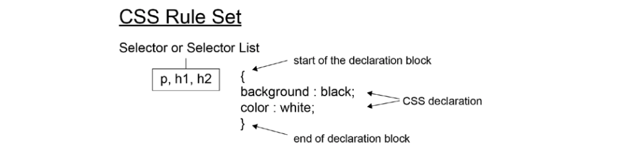

## Chapter 1 : Introduction to HTML and CSS

### Introduction

### HyperText Markup Language (HTML)

- Syntax

  

  ```html
  <!-- HTML -->
  <h1>HTML</h1>
  <p>
    HyperText Markup Language (HTML) is a markup language used to describe the
    structure of a web page.
  </p>
  <p>
    We can use it to differentiate such content as:
  </p>
  <ul>
    <li>headings</li>
    <li>lists</li>
    <li>links</li>
    <li>images</li>
  </ul>
  <p>
    Want to
    <a href="https://www.packtpub.com/web-development"
      >learn more about web development?</a
    >
  </p>
  ```

- Content Types

  ```
  Metadata
  Flow
  Sectioning
  Phrasing
  Heading
  Embedded
  Interactive
  ```

- The HTML Document

  ```html
  <html>
    <head>
      <title>HTML Document structure</title>
    </head>
    <body>
      <div>
        <h1>Heading</h1>
        <p>First paragraph of text.</p>
        <p>Second paragraph of text.</p>
      </div>
    </body>
  </html>
  ```

- The HTML DOM

  ```js
  <script>
    const anchorElement = document.createElement('a'); anchorElement.href = '#';
    anchorElement.textContent = 'Click me!'; const p =
    document.querySelector('.parent'); p.appendChild(anchorElement);
  </script>
  ```

- The Doctype Declaration
  ```html
  <!DOCTYPE html>
  ```

### Structuring an HTML Document

- HTML
  ```html
  <!DOCTYPE html>
  <html lang="en"></html>
  ```
- Head

  ```html
  <!DOCTYPE html>
  <html lang="en">
    <head>
      <title>Page Title</title>
    </head>
  </html>
  ```

- Body

  ```html
  <!DOCTYPE html>
  <html lang="en">
    <head>
      <title>Page Title</title>
    </head>
    <body></body>
  </html>
  ```

- Our First Web Page
- _Exercise 1.01: Creating a Web Page_

  

- Metadata

  ```html
  <base href="http://www.example.com" />
  <link rel="stylesheet" href="/style.css" />

  <meta charset="utf-8" />

  <meta name="viewport" content="width=device-width, initial-scale=1" />
  ```

- Exercise 1.02: Adding Metadata

  

### Mistakes in HTML

```html
<p>
Learn about <a href="https://www.packtpub.com/web-development">web development</a>. Try out some of the <a href="https://www.packtpub.com/free-learning">Free learning on the Packt site.
</p> <p>
Lorem ipsum... </p>
```

```html
<body>
  <main id="main1"><!-- main content here ... --></main>
  <main id="main2"><!-- more main content here ... --></main>
</body>
```

```html
<body>
  <main id="main1"><!-- main content here ... --></main>
  <main id="main2" hidden><!-- more main content here ... --></main>
</body>
```

### Validating HTML

```link
https://validator.w3.org/
```

- _Exercise 1.03: Validation_
- _Exercise 1.04: Validation Errors_
- _Activity 1.01: Video Store Page Template_

### CSS

- Syntax
  ```css
  p {
    color: red;
    font-weight: bold;
    text-decoration: underline;
  }
  ```
- CSS Rule Set

  

- Adding Styles to a Web Page
- _Exercise 1.05: Adding Styles_

  

- _Exercise 1.06: Styles in an External Fils_

### CSSOM

### CSS Selectors

```css
h1::first-letter {
  font-size: 5rem;
}
p {
  color: white;
  background-color: black;
}
p:nth-of-type(odd) {
  color: black;
  background-color: white;
}
```

- Element, #ID and .Class

  ```css
  .class {
  }
  #id {
  }
  div {
  }
  ```

- The Universal Selectors (\*)

  ```css
  * {
  }
  ```

- Attribute Selectors

  ```css
  [attribute]
  [href]
  [attribute=value]
  [attribute^=value]
  [attribute$=value]
  [attribute*=valule]
  ```

- Pseudo-classes (:)

  ```css
  :link
  :hover
  :visited
  :active
  :first-child
  :last-child
  :nth-child()
  :nth-last-child()
  :first-of-type
  :last-of-type
  :nth-of-type()
  :nth-last-of-type()
  ```

  ```css
  a:link,
  a:visited {
    color: deepskyblue;
    text-decoration: none;
  }
  a:hover,
  a:active {
    color: hotpink;
    text-decoration: dashed underline;
  }
  ```

- Pseudo-elements (::)

  ```css
  ::before
  ::after
  ::first-letter
  ::first-line
  ::selection
  ::backdrop
  ```

- Combining Selectors

  ```css
  .primary li.primary;
  ```

- _Exercise 1.07: Selecting Elements_

  

### CSS Specificity

### The Special Case of `!important`

```css
/* CSS */
div.media {
  display: block;
  width: 100%;
  float: left;
}
.hide {
  display: none;
}
```

```html
<!-- HTML -->
<div class="media hide">
  ...Some content
</div>
```

```css
.hide {
  display: none !important;
}
```

- _Activity 1.02: Styling the Video Store Template Page_

### Dev Tools

- The Top Bar

  ```
  Console
  Elements ***
  Sources
  Network
  Performance
  ```

- The Element Tap

<!-- CONTACT -->

## Contact

Oat Phattaraphon - [@phattaraphon_c](https://twitter.com/phattaraphon_c)
