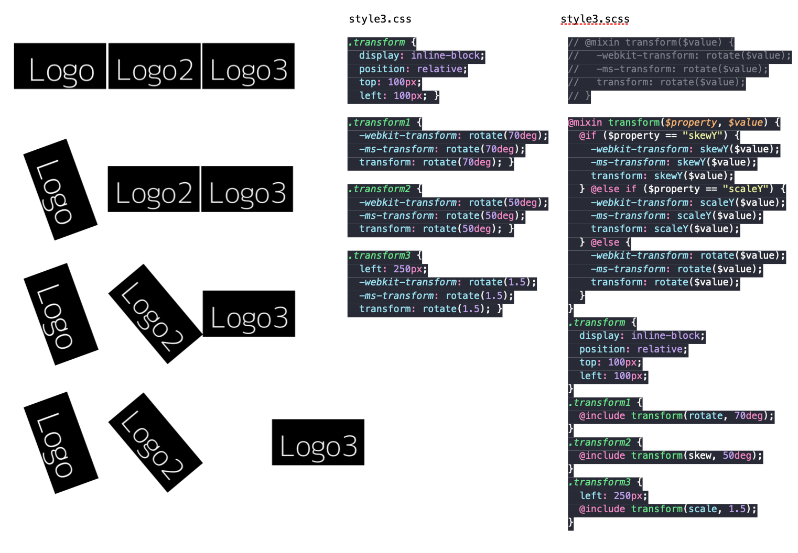

# Chapter 10: Preprocessors and Tooling

[Introduction to CSS Preprocessors](#Introduction-to-CSS-Preprocessors)

[Getting Started with Nodejs npm and SASS](#Getting-Started-with-Nodejs-npm-and-SASS)

[SCSS Introduction](#SCSS-Introduction)

- [Exercise 10.01: Using SCSS Variables](#Exercise-10.01:-Using-SCSS-Variables)

[Nesting in SCSS](#Nesting-in-SCSS)

- [Exercise 10.02: Rewriting Existing CSS with Nested SCSS](#Exercise-10.02:-Rewriting-Existing-CSS-with-Nested-SCSS)

[Import Control Directives and Mixins in SCSS](#Import-Control-Directives-and-Mixins-in-SCSS)

- [Exercise 10.03: Using SCSS Mixins and Control Directives](#Exercise-10.03:-Using-SCSS-Mixins-and-Control-Directives)

[Loops in SCSS](#Loops-in-SCSS)

- [Exercise 10.04: Loops in SCSS](#Exercise-10.04:-Loops-in-SCSS)
- [Activity 10.01: Converting the Video Store Home Page into SCSS](#Activity-10.01:-Converting-the-Video-Store-Home-Page-into-SCSS)

## Introduction to CSS Preprocessors

- `Syntactically Awesome Style Sheets (SASS)`
- `Leaner Style Sheets (LESS)`

## Getting Started with Nodejs npm and SASS

## SCSS Introduction

- `package.json`
- `"scss": "node-sass --watch scss -o css --output-style expanded"`

  ```scss
  // SCSS
  $color-black: #000;
  p {
    color: $color-black;
  }
  ```

  ```css
  /* CSS */
  h1 {
    color: #000;
  }
  ```

  ```scss
  // SCSS
  $color-black: #000;
  p {
    color: $color-black;
  }
  ```

  ```css
  /* CSS */
  p {
    color: #000;
  }
  ```

  

- ### _Exercise 10.01: Using SCSS Variables_

  

## Nesting in SCSS

- `package.json`
- `"scss": "node-sass --watch scss -o css --output-style nested"`

  ```scss
  // SCSS
  article {
    background: #ccc;
    p {
      color: red;
    }
  }
  ```

  ```css
  /* CSS */
  article {
    background: #ccc;
  }
  article p {
    color: red;
  }
  ```

  ```scss
  // SCSS
  article {
    background: #ccc;
    p {
      color: red;
      a {
        color: blue;
        &:hover {
          text-decoration: underline;
        }
      }
    }
  }
  ```

  ```css
  /* CSS */
  article {
    background: #ccc;
  }
  article p {
    color: red;
  }
  article p a {
    color: blue;
  }
  article p a:hover {
    text-decoration: underline;
  }
  ```

  

  

  

- ### _Exercise 10.02: Rewriting Existing CSS with Nested SCSS_

  

## Import Control Directives and Mixins in SCSS

The syntax for importing another SCSS file (for example, `'_filename.scss'`) into your main file is `@import 'filename'`;. To see this in an example, look at the following code

- `_reset.scss`

  ```scss
  * {
    margin: 0;
    padding: 0;
  }
  ul,
  li {
    list-style: none;
  }
  ```

- `build.scss`

  ```scss
  @import "reset";
  header {
    background: #ccc;
    a {
      color: #000;
      &:hover {
        text-decoration: underline;
      }
    }
  }
  ```

- This would output with the `_reset.scss` file already compiled and merged into `build.css` as a single file outputted:

  ```css
  * {
    margin: 0;
    padding: 0;
  }
  ul,
  li {
    list-style: none;
  }
  header {
    background: #ccc;
  }
  header a {
    color: #000;
  }
  header a:hover {
    text-decoration: underline;
  }
  ```

- `debug`

  ```scss
  $debug = true; @if ($debug) {
    div {
        border: 1px dashed red;
  } }
  ```

- `else if` and `else`

  ```scss
  $env: "test";
  div {
    @if ($env == "dev") {
      border: 1px dotted red;
    } @else if ($env == "test") {
      border: 1px dotted yellow;
    } @else if ($env == "live") {
      border: 1px dotted black;
    } @else {
      border: none;
    }
  }
  ```

- `mixin`

  ```scss
  @mixin columns($count) {
    -webkit-column-count: $count;
    -moz-column-count: $count;
    column-count: $count;
  }
  article {
    @include columns(2);
  }
  ```

  

- ### _Exercise 10.03: Using SCSS Mixins and Control Directives_

  

## Loops in SCSS

- `for` : `@for $variable from X to Y {}`

  ```scss
  // SCSS
  @for $num from 1 through 4 {
    .col-#{$num} {
      column-count: $num;
    }
  }
  ```

  ```css
  /* CSS */
  .col-1 {
    column-count: 1;
  }
  .col-2 {
    column-count: 2;
  }
  .col-3 {
    column-count: 3;
  }
  .col-4 {
    column-count: 4;
  }
  ```

- `each` : `@each $item in $list {}`

  ```scss
  // SCSS
  $fruits: apple pear orange kiwi pineapple melon strawberry;

  @each $fruit in $fruits {
    .image-#{$fruit} {
      background: url("images/#{$fruit}.png") no-repeat;
    }
  }
  ```

  ```css
  /* CSS */
  .image-apple {
    background: url("images/apple.png") no-repeat;
  }
  .image-pear {
    background: url("images/pear.png") no-repeat;
  }
  .image-orange {
    background: url("images/orange.png") no-repeat;
  }
  .image-kiwi {
    background: url("images/kiwi.png") no-repeat;
  }
  .image-pineapple {
    background: url("images/pineapple.png") no-repeat;
  }
  .image-melon {
    background: url("images/melon.png") no-repeat;
  }
  .image-strawberry {
    background: url("images/strawberry.png") no-repeat;
  }
  ```

- `while` : `@while $variable condition value {}`

  ```scss
  // SCSS
  $box: 25;
  @while $box > 0 {
    .box-#{$box} {
      width: $box + px;
    }
    $box: $box - 5;
  }
  ```

  ```css
  /* CSS */
  .box-25 {
    width: 25px;
  }
  .box-20 {
    width: 20px;
  }
  .box-15 {
    width: 15px;
  }
  .box-10 {
    width: 10px;
  }
  .box-5 {
    width: 5px;
  }
  ```

- ### _Exercise 10.04: Loops in SCSS_

  

- ### _Activity 10.01: Converting the Video Store Home Page into SCSS_

  
