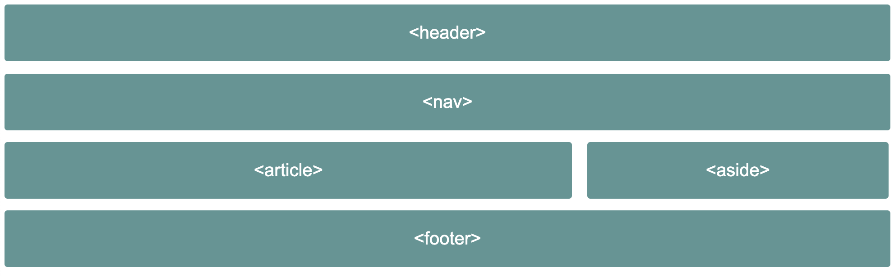

# Chapter 2: Structure and Layout

## Structural Elements

```html
<header></header>
<nav></nav>
<article></article>
<section></section>
<aside></aside>
<footer></footer>
```

### The header Tag

```html
<header>
  ... heading, logo, nav goes here
  <header></header>
</header>
```

### The footer Tag

```html
<footer>
  ... copyright, list of links go here
  <footer></footer>
</footer>
```

### The section Tag

```html
<section>
  ... main content
</section>
```

### The article Tag

```html
<article>
  <section>
    ...primary blog content
  </section>
  <section>
    ...secondary blog content
  </section>
</article>
```

### The nav Tag

```html
<navigation> ... list of links go here </navigation>
```

### The aside Tag

```html
<aside>
  ... indirectly related content goes here
</aside>
```

### The div Tag

```html
<div class="sidebar">
  ... indirectly related content goes here
</div>
<div class="navigation">
  <div class="navigation-inner">... navigation links go here</div>
</div>
```

### A News Article Web Page

```a
https://theguardian.com
https://bbc.co.uk/news
```

### _Exercise 2.01: Marking up the Page_



### Wireframes

### _Activity 2.01: Video Store Home Page_


---

## CSS Page Layouts

```css
float
flex
grid
```

### Video Store Product Page

### Float-Based Layout

- The float Property

  ```css
  float: right;
  float: left;
  float: none;
  ```

- the width Property

  ```css
  width: 100px;
  width: 25%;
  ```

- Claring Floated Element

  ```css
  /* CSS */
  section {
    overflow: hidden;
  }
  div {
    float: left;
    width: 25%;
  }
  ```

  ```html
  <!-- HTML -->
  <section>
    <div>product 1</div>
    <div>product 2</div>
    <div>product 3</div>
    <div>product 4</div>
    <div>product 5</div>
    <div>product 6</div>
    <div>product 7</div>
    <div>product 8</div>
  </section>
  ```

### Flex-Based Layout

- The flex Container

  ```css
  display: flex;
  ```

  ```css
  flex-wrap: wrap;
  ```

- The flex Items
  `css flex-basis: 25%;`

  ```html
  <!-- HTML -->
  <section>
    <div>product 1</div>
    <div>product 2</div>
    <div>product 3</div>
    <div>product 4</div>
    <div>product 5</div>
    <div>product 6</div>
    <div>product 7</div>
    <div>product 8</div>
  </section>
  ```

  ```css
  /* CSS */
  section {
    display: flex;
    flex-wrap: wrap;
  }
  div {
    flex-basis: 25%;
  }
  ```

### Grid-Based Layout

- The grid Container

  ```css
  display: grid;
  ```

  ```css
  grid-template-columns: auto auto;
  ```

- The grid Items

### _Exercise 2.02: A grid-Based Layout_


## The Box Model

```css
margin
border
padding
content
width
height
```

### Content Box

```css
width: 200px;
height: 100px;
```

### The padding Property

```css
padding: 50px;
padding: 50px 0;
padding-top: 10px;
padding-right: 10px;
padding-bottom: 10px;
padding-left: 10px;
```

```css
width: 200px;
height: 100px;
padding: 25px;
```

### The border Property

```css
border: 5px solid red;
border-top: 5px solid red;
border-right: 15px dotted green;
border-bottom: 10px dashed blue;
borber-left: 10px double pink;
```

```css
width: 200px;
height: 100px;
padding: 25px;
border: 10px solid black;
```

### The margin Property

```css
margin: 50px;
margin: 50px 0;
margin-top: 10px;
margin-right: 10px;
margin-bottom: 10px;
margin-left: 10px;
```

```css
width: 200px;
height: 100px;
padding: 25px;
border: 10px solid black;
margin: 25px;
```

### _Exercise 2.03: Experimenting with the Box Model_


### Putting It All Together

### _Exercise 2.04: Home Page Revisited_


### _Exercise 2.05: Video Store Product Page Revisited_


### _Activity 2.02: Online Clothes Store Home Page_


<!-- CONTACT -->

## Contact

Oat Phattaraphon - [@phattaraphon_c](https://twitter.com/phattaraphon_c)
