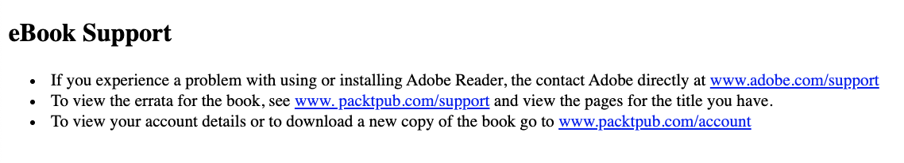

# Chapter 3: Text and Typography

## Table of Contents

[Text-Based Elements](#text-based-element)

- [Heading](#heading)
- [Paragraphs](#paragraph)
- [Inline Text Elements](#inline-text-elements)
- [Lists](#lists)
- [Exercise 3.01: Combining Text-Based Elements](#Exercise-3.01:-Combining-Text-Based-Elements)

[Semantic Markup](#Semantic-Markup)

[Styling Text-Based Elements](#Styling-Text-Based-Elements)

- [CSS Resets](#CSS-Resets)
- [CSS Text Properties](#CSS-Text-Properties)
- [CSS Font Properties](#CSS-Font-Properties)
- [The display Properties](#The-display-Properties)
- [Video Store Product Page (Revisied)](<#Video-Store-Product-Page-(Revisied)>)
- [Exercise 3.02: Navigation](#Exercise-3.02:-Navigation)

[Breadcrumbs](#Breadcrumbs)

- [Exercise 3.03: Breadcrumb](#Exercise-3.03:-Breadcrumb)
- [Exercise 3.04: Page Heading and Introduction](#Exercise-3.04:-Page-Heading-and-Introduction)
- [Exercise 3.06: Putting It All Together](#Exercise-3.06:-Putting-It-All-Together)

## Text-Based Elements

```
- Headings
- Paragraphs
- Inline elements
- Lists
```

- ### Headings

  ```html
  <h1>Heading level 1</h1>
  <h2>Heading level 2</h2>
  <h3>Heading level 3</h3>
  <h4>Heading level 4</h4>
  <h5>Heading level 5</h5>
  <h6>Heading level 6</h6>
  ```

- ### Paragraphs

  ```html
  <p>
    Sit down awhile, And let us once again assail your ears, That are so
    fortified against our story,
  </p>
  ```

- ### Inline Text Elements

  ```html
  <p>I need to wake up <em>now</em>!</p>
  ```

  ```html
  <p>
    Before leaving the house <strong>remember to lock the front door</strong>!
  </p>
  ```

- ### Lists

  ```html
  <!-- Shopping list -->
  <ul>
    <li>Ice Cream</li>
    <li>Cookies</li>
    <li>Salad</li>
    <li>Soap</li>
  </ul>
  ```

  ```html
  <!-- Cheese on toast recipe -->
  <ol>
    <li>Place bread under grill until golden brown</li>
    <li>Flip the bread and place cheese slices</li>
    <li>Cook until cheese is golden brown</li>
    <li>Serve immediately</li>
  </ol>
  ```

  ```html
  <!-- Dictionary -->
  <dl>
    <dt>HTML</dt>
    <dd>Hypertext markup language</dd>
    <dt>CSS</dt>
    <dd>Cascading style sheets</dd>
  </dl>
  ```

- ### _Exercise 3.01: Combining Text-Based Elements_

  

## Semantic Markup

```html
<!-- Semantic markup -->
<h1>I am a top level page heading</h1>
<p>
  This is a paragraph which contains a word with
  <strong>strong</strong> significance
</p>
<!-- Non semantic markup -->
<div>I am a top level page heading</div>
<div>
  This is a paragraph which contains a word with
  <span>strong</span> significance
</div>
```

## Styling Text-Based Elements

- ### CSS Resets

  ```css
  * {
    margin: 0;
    padding: 0;
  }
  ```

  ```css
  /* http://meyerweb.com/eric/tools/css/reset/ v2.0 | 20110126
  License: none (public domain)
  */
  html,
  body,
  div,
  span,
  applet,
  object,
  iframe,
  h1,
  h2,
  h3,
  h4,
  h5,
  h6,
  p,
  blockquote,
  pre,
  a,
  abbr,
  acronym,
  address,
  big,
  cite,
  code,
  del,
  dfn,
  em,
  img,
  ins,
  kbd,
  q,
  s,
  samp,
  small,
  strike,
  strong,
  sub,
  sup,
  tt,
  var,
  b,
  u,
  i,
  center,
  dl,
  dt,
  dd,
  ol,
  ul,
  li,
  fieldset,
  form,
  label,
  legend,
  table,
  caption,
  tbody,
  tfoot,
  thead,
  tr,
  th,
  td,
  article,
  aside,
  canvas,
  details,
  embed,
  figure,
  figcaption,
  footer,
  header,
  hgroup,
  menu,
  nav,
  output,
  ruby,
  section,
  summary,
  time,
  mark,
  audio,
  video {
    margin: 0;
    padding: 0;
    border: 0;
    font-size: 100%;
    font: inherit;
    vertical-align: baseline;
  }
  /* HTML5 display-role reset for older browsers */
  article,
  aside,
  details,
  figcaption,
  figure,
  footer,
  header,
  hgroup,
  menu,
  nav,
  section {
    display: block;
  }
  body {
    line-height: 1;
  }
  ol,
  ul {
    list-style: none;
  }
  blockquote,
  q {
    quotes: none;
  }
  blockquote:before,
  blockquote:after,
  q:before,
  q:after {
    content: "";
    content: none;
  }
  table {
    border-collapse: collapse;
    border-spacing: 0;
  }
  ```

- ### CSS Text Properties

  ```css
  h1 {
    color: green;
  }
  p {
    color: #00ff00;
  }
  span {
    color: rgb(0, 255, 0);
  }
  p {
    text-align: center;
  }
  /* ขีดเส้นใต้หนังสือ */
  .underline {
    text-decoration: underline;
  }
  /* เส้นทับตัวหนังสือ */
  .line-through {
    text-decoration: line-through;
  }
  /* ตัวใหญ่หมด */
  .uppercase {
    text-transform: uppercase;
  }
  /* ตัวเล็กหมด */
  .lowercase {
    text-transform: lowercase;
  }
  /* อักษรตัวแรกใหญ่ */
  .capitalize {
    text-transform: capitalize;
  }
  /* ความชิดของแต่ละบรรทัด น้อย */
  .small-line-height {
    line-height: 0.5;
  }
  /* ความชิดของแต่ละบรรทัด มาก */
  .large-line-height {
    line-height: 1.5;
  }
  ```

- ### CSS Font Properties

  ```css
  body {
    font-family: "Times New Roman", Times, serif;
  }
  /* pixels */
  h1 {
    font-size: 50px;
  }
  p {
    font-size: 16px;
  }
  /* ems */
  h1 {
    font-size: 3.125em;
  }
  p {
    font-size: 1em;
  }
  span {
    font-weight: bold;
  }
  ```

- ### The display Properties

  ```css
  div {
    display: inline;
  }
  span {
    display: block;
  }
  ```

- ### Video Store Product Page (Revisied)

- ### _Exercise 3.02: Navigation_

  

## Breadcrumbs

- ### _Exercise 3.03: Breadcrumb_

  

- ### _Exercise 3.04: Page Heading and Introduction_

  

- ### _Exercise 3.05: Product Cards_

  

- ### _Exercise 3.06: Putting It All Together_

  

- ### _Activity 3.01: Converting a Newspaper Article to a Web Page_

<!-- CONTACT -->

## Contact

Oat Phattaraphon - [@phattaraphon_c](https://twitter.com/phattaraphon_c)
