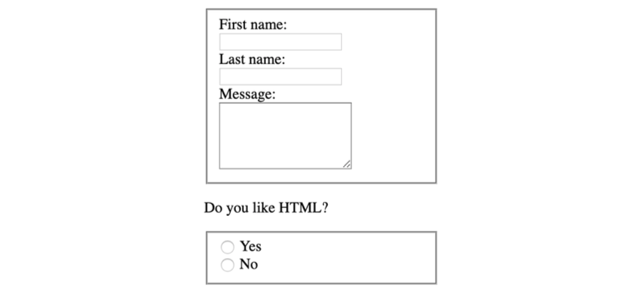
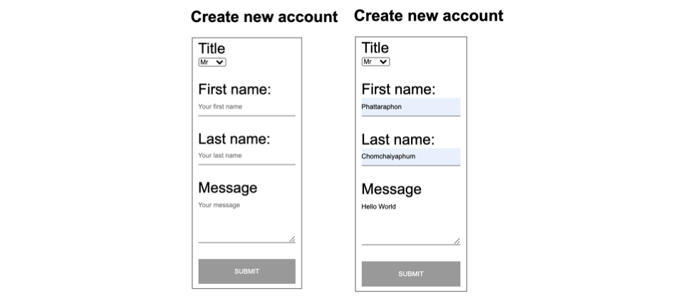
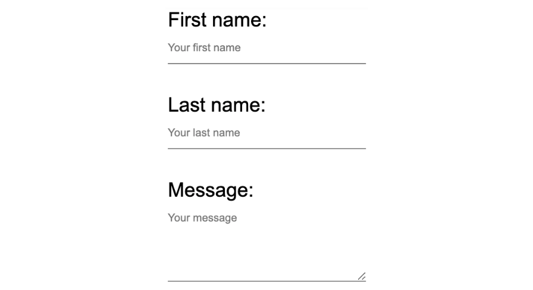
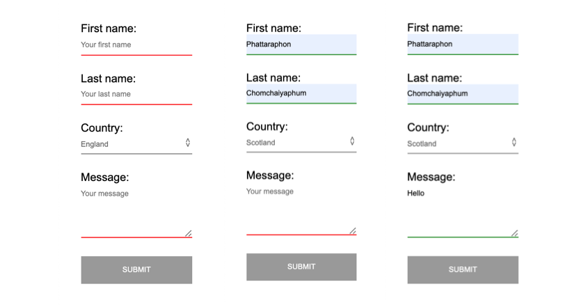
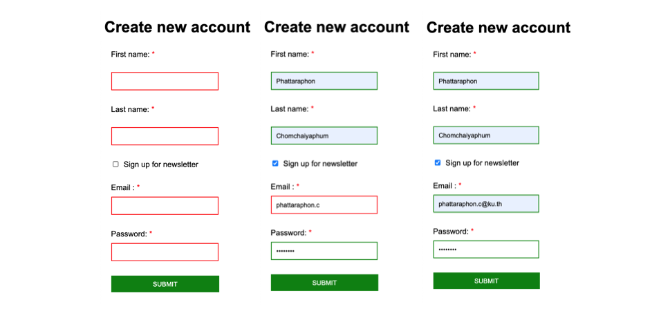
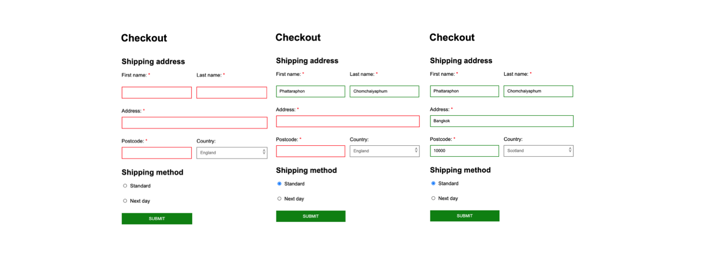

# Chapter 4 : Forms

## Table Content

[Form Elements](#Form-Elements)

- [The form Element](#The-form-Element)
- [The input Element](#The-input-Element)
- [The label Element](#The-label-Element)
- [The textarea Element](#The-textarea-Element)
- [The fieldset Element](#The-fieldset-Element)
- [The select Element](#The-select-Element)
- [The button Element](#The-button-Element)
- [Exercise 4.01: Creating a Simple Form](#Exercise-4.01:-Creating-a-Simple-Form)

[Styling Form Elements](#Styling-Form-Elements)

- [Label, Textbox, and Textarea](#Label-Textbox-and-Textarea)
- [Buttons](#Buttons)
- [Select Boxes](#Select-Boxes)
- [Validation Styling](#Validation-Styling)
- [Exercise 4.02: Creating a Form with Validation Styling](#Exercise-4.02:-Creating-a-Form-with-Validation-Styling)
- [Video Store Forms](#Video-Store-Forms)
- [Exercise 4.03: New Account Signup Form](#Exercise-4.03:-New-Account-Signup-Form)
- [Exercise 4.04: Checkout Form](#Exercise-4.04:-Checkout-Form)
- [Activity 4.01: Building an Online Property Portal Website Form](#Activity-4.01:-Building-an-Online-Property-Portal-Website-Form)

[Summary](#Summary)

## Introduction

## Form Elements

- `form`
- `input`
- `label`
- `textarea`
- `fieldset`
- `select`
- `button`

* ### The form Element

  `form`, `action`, `method`, `get`, `post`

  ```html
  <form action="url_to_send_form_data" method="post">
    <!-- form elements go here -->
  </form>
  ```

- ### The input Element

  `type`, `name`, `value`, `maxlength`

  ```html
  <!-- text input -->
  <form action="url_to_send_form_data" method="post">
    <div>
      First name: <br />
      <input type="text" name="firstname" />
    </div>
    <div>
      Last name: <br />
      <input type="text" name="lastname" />
    </div>
  </form>
  ```

  

  ```html
  <!-- maxlength -->
  <input type="text" name="username" maxlength="20" />
  ```

  ```html
  <!-- email input -->
  <form action="url_to_send_form_data" method="post">
    <div>
      Email: <br />
      <input type="email" name="email" />
    </div>
  </form>
  ```

  

  ```html
  <!-- password input -->
  <form action="url_to_send_form_data" method="post">
    <div>
      Password: <br />
      <input type="password" name="password" />
    </div>
  </form>
  ```

  

  ```html
  <!-- value -->
  <!-- checkboxes -->
  <form action="url_to_send_form_data" method="post">
    <div><input type="checkbox" name="color1" value="red" /> Red</div>
    <div><input type="checkbox" name="color2" value="green" /> Green</div>
    <div><input type="checkbox" name="color3" value="blue" /> Blue</div>
    ..
  </form>
  ```

  

  ```html
  <!-- radio buttons -->
  <form action="url_to_send_form_data" method="post">
    <div><input type="radio" name="color" value="red" /> Red</div>
    <div><input type="radio" name="color" value="green" /> Green</div>
    <div><input type="radio" name="color" value="blue" /> Blue</div>
  </form>
  ```

  

- ### The label Element

  `label`, `for`, `id`

  ```html
  <!-- text inputs with labels -->
  <form action="url_to_send_form_data" method="post">
    <div>
      <label for="first_name">First name:</label><br />
      <input type="text" name="firstname" id="first_name" />
    </div>
    <div>
      <label for="last_name">Last name:</label><br />
      <input type="text" name="lastname" id="last_name" />
    </div>
  </form>
  ```

  

* ### The textarea Element

  `textarea`, `rows`, `cols`

  ```html
  <!-- textarea -->
  <form action="url_to_send_form_data" method="post">
    <div>
      <label for="first_name">First name:</label><br />
      <input type="text" name="firstname" id="first_name" />
    </div>
    <div>
      <label for="last_name">Last name:</label><br />
      <input type="text" name="lastname" id="last_name" />
    </div>
    <div>
      <label for="message">Message:</label><br />
      <textarea id="last_name" rows="5" cols="20"></textarea>
    </div>
  </form>
  ```

  

- ### The fieldset Element

  `fieldset`

  ```html
  <!-- fieldset -->
  <form action="url_to_send_form_data" method="post">
    <fieldset>
      <div>
        <label for="first_name">First name:</label><br />
        <input type="text" name="firstname" id="first_name" />
      </div>
      <div>
        <label for="last_name">Last name:</label><br />
        <input type="text" name="lastname" id="last_name" />
      </div>
      <div>
        <label for="message">Message:</label><br />
        <textarea id="last_name" rows="5" cols="20"></textarea>
      </div>
    </fieldset>
    <p>Do you like HTML?</p>
    <fieldset>
      <div>
        <input type="radio" id="yes" />
        <label for="yes">Yes</label>
      </div>
      <div>
        <input type="radio" id="no" />
        <label for="no">No</label>
      </div>
    </fieldset>
  </form>
  ```

  

* ### The select Element

  `select`, `option`

  ```html
  <!-- select -->
  <form action="url_to_send_form_data" method="post">
    <fieldset>
      <label for="countries">Country:</label><br />
      <select id="countries">
        <option value="england">England</option>
        <option value="scotland">Scotland</option>
        <option value="ireland">Ireland</option>
        <option value="wales">Wales</option>
      </select>
    </fieldset>
  </form>
  ```

  

* ### The button Element

  `button`, `type`, `reset`, `submit`

  ```html
  <button type="submit">Submit</button>
  ```

* ### _Exercise 4.01: Creating a Simple Form_

  

## Styling Form Elements

- `Textbox`
- `Textarea`
- `Label`
- `Button`
- `Select box`
- `Validation styling`

* ### Label Textbox and Textarea

  `label`, `textarea`

  ```html
  <!-- HTML -->
  <form action="url_to_send_form_data" method="post">
    <div>
      <label for="first_name">First name:</label><br />
      <input
        type="text"
        name="firstname"
        id="first_name"
        placeholder="Your first name"
      />
    </div>
    <div>
      <label for="last_name">Last name:</label><br />
      <input
        type="text"
        name="lastname"
        id="last_name"
        placeholder="Your last name"
      />
    </div>
    <div>
      <label for="message">Message:</label><br />
      <textarea
        id="last_name"
        rows="5"
        cols="20"
        placeholder="Your message"
      ></textarea>
    </div>
  </form>
  ```

  ```css
  /* CSS */
  * {
    font-family: arial, sans-serif;
  }
  label {
    font-size: 20px;
  }
  div {
    margin-bottom: 30px;
  }
  input,
  textarea {
    border: 0;
    border-bottom: 1px solid gray;
    padding: 10px 0;
    width: 200px;
  }
  ```

  

- ### Buttons

  `button`, `submit`

  ```html
  <!-- HTML -->
  <button type="submit">Submit</button>
  ```

  ```css
  /* CSS */
  button {
    background: #999;
    border: 0;
    color: white;
    font-size: 12px;
    height: 50px;
    width: 200px;
    text-transform: uppercase;
  }
  ```

  

- ### Select Boxes

  `select`

  ```html
  <!-- HTML -->
  <div class="select-wrapper">
    <select id="countries">
      <option value="england">England</option>
      <option value="scotland">Scotland</option>
      <option value="ireland">Ireland</option>
      <option value="wales">Wales</option>
    </select>
  </div>
  ```

  ```css
  /* CSS */
  select {
    background: transparent;
    border: 0;
    border-radius: 0;
    border-bottom: 1px solid gray;
    box-shadow: none;
    color: #666;
    padding: 10px 0;
    width: 200px;
    -webkit-appearance: none;
  }
  .select-wrapper {
    position: relative;
    width: 200px;
  }
  .select-wrapper:after {
    content: "< >";
    color: #666;
    font-size: 14px;
    top: 8px;
    right: 0;
    transform: rotate(90deg);
    position: absolute;
    z-index: -1;
  }
  ```

  

* ### Validation Styling

  `required`, `:valid`, `:valid`

- ### _Exercise 4.02: Creating a Form with Validation Styling_

  

* ### Video Store Forms
* ### _Exercise 4.03: New Account Signup Form_

  

* ### _Exercise 4.04: Checkout Form_

  

- ### _Activity 4.01: Building an Online Property Portal Website Form_

## Summary

<!-- CONTACT -->

## Contact

Oat Phattaraphon - [@phattaraphon_c](https://twitter.com/phattaraphon_c)
