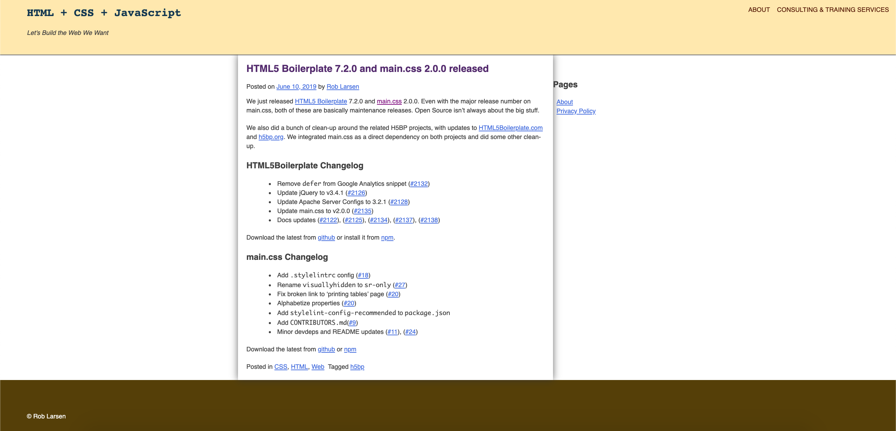
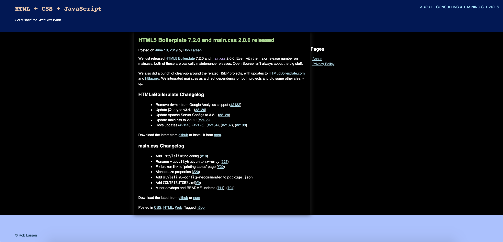
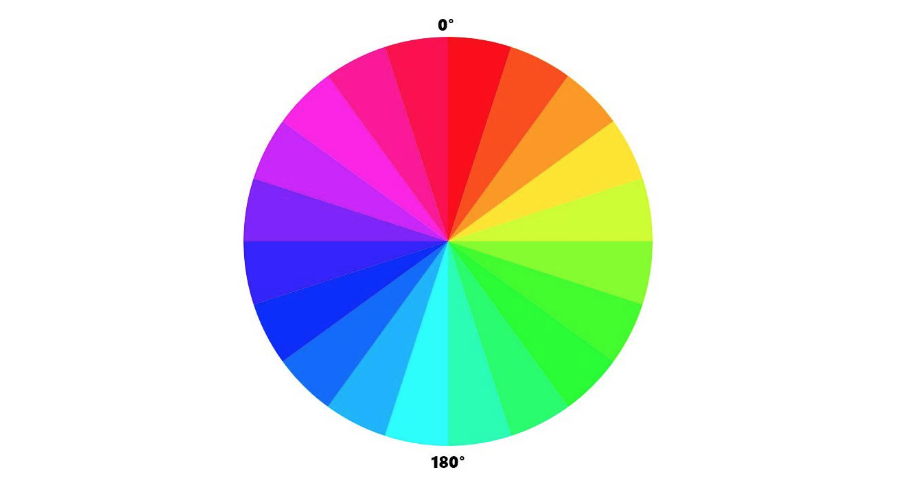
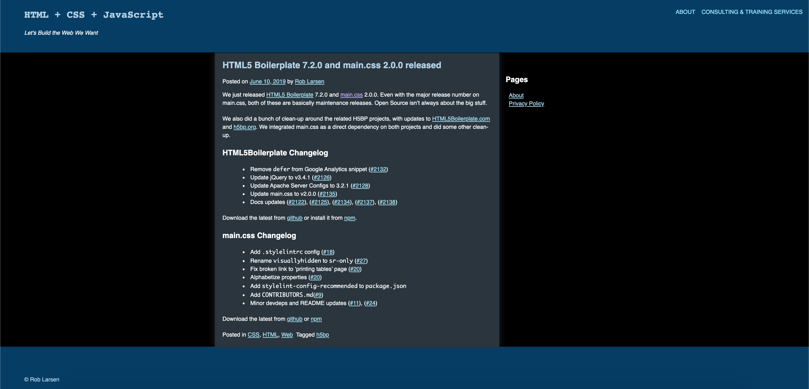
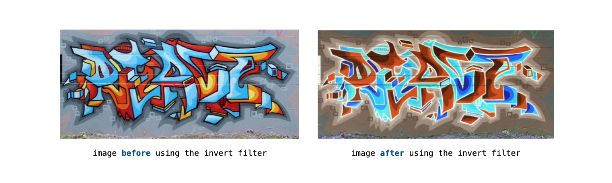
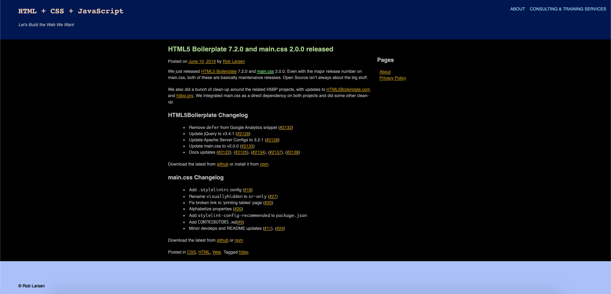
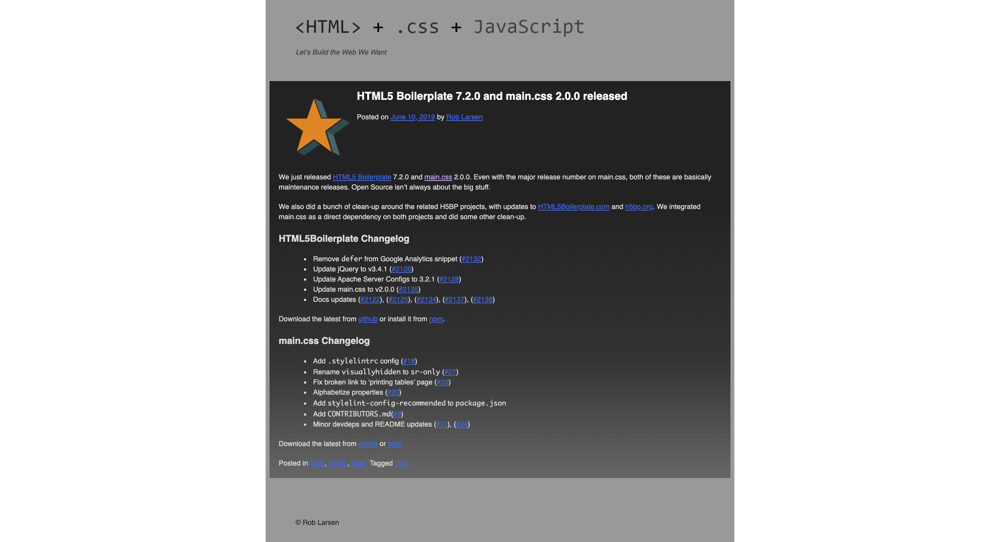

# Chapter 5: Themes, Colors, and Polish

## Table Content

[Introduction](#Introduction)

- [The Markup](#The-Markup)
- [Inverting Colors](#Inverting-Colors)
- [New HTML Elements in the Theme](#New-HTML-Elements-in-the-Theme)
- [New CSS Background Properties](#New-CSS-Background-Properties)
- [Exercise 5.01: Creating a Dark Theme](#Exercise-5.01:-Creating-a-Dark-Theme)
- [Creating a Dark Theme with the HSL Function](#Creating-a-Dark-Theme-with-the-HSL-Function)
- [Exercise 5.02: Creating a Dark Theme Using hsl](#Exercise-5.02:-Creating-a-Dark-Theme-Using-hsl)
- [CSS Invert Filter](#CSS-Invert-Filter)
- [Exercise 5.03: Creating a Dark Theme with the CSS Invert Filter](#Exercise-5.03:-Creating-a-Dark-Theme-with-the-CSS-Invert-Filter)
- [CSS Hooks](#CSS-Hooks)
- [Exercise 5.04: Customizing a Theme with CSS Hooks](#Exercise-5.04:-Customizing-a-Theme-with-CSS-Hooks)
- [Activity 5.01: Creating Your Own Theme Using a New Color Palette](#Activity-5.01:-Creating-Your-Own-Theme-Using-a-New-Color-Palette)

[Summary](#Summary)

## Introduction

### The Markup



### Inverting Colors

```link
https://www.colortools.net/color_complementary.html
```

### New HTML Elements in the Theme

- `pre` (preformatted element)
- `abbr` (abbreviation element)

### New CSS Background Properties

- `background-image`
- `background-repeat`
  - `repeat`
  - `space`
  - `round`
  - `no-repeat`

### _Exercise 5.01: Creating a Dark Theme_



### Creating a Dark Theme with the HSL Function

The HSL function allows you to update the color value of a property by using one of three arguments: **H**ue, **S**aturation, or **L**ightness:

- `H` represents the hue as an angle on the color wheel. You can specify this using degrees (or, programmatically, radians.) When provided as a unitless number, it is interpreted as degrees, with 0 as pure red, 120 as pure green, and 240 as pure blue.
- `S` represents the saturation, with 100% saturation being completely saturated, while 0% is completely unsaturated (gray). 50% is a "normal" color.
- `L` represents the saturation, with 100% saturation being completely saturated, while 0% is completely unsaturated (gray).

  

### _Exercise 5.02: Creating a Dark Theme Using hsl_



### CSS Invert Filter

`filter: invert().`



```html
<!DOCTYPE html>
<html lang="en-US">
  <head>
    <meta http-equiv="Content-Type" content="text/html; charset=UTF-8" />
    <title>Invert Filter</title>
    <style type="text/css">
      .invert {
        filter: invert(100%);
      }
    </style>
  </head>
  <body>
    <p>
      
    </p>
    <p>
      
    </p>
  </body>
</html>
```

### _Exercise 5.03: Creating a Dark Theme with the CSS Invert Filter_



### CSS Hooks

```html
<!DOCTYPE html>
<html lang="en-US">
  <head>
    <meta http-equiv="Content-Type" content="text/html; charset=UTF-8" />
    <title>Using CSS hooks</title>
    <style type="text/css">
      .tag-css {
        background: #003366;
      }
      .tag-html {
        background: #006600;
      }
      .tag-javascript {
        background: #660000;
      }
    </style>
  </head>
  <body class="tag-css"></body>
</html>
```

### _Exercise 5.04: Customizing a Theme with CSS Hooks_



### _Activity 5.01: Creating Your Own Theme Using a New Color Palette_

## Summary

<!-- CONTACT -->

## Contact

Oat Phattaraphon - [@phattaraphon_c](https://twitter.com/phattaraphon_c)
