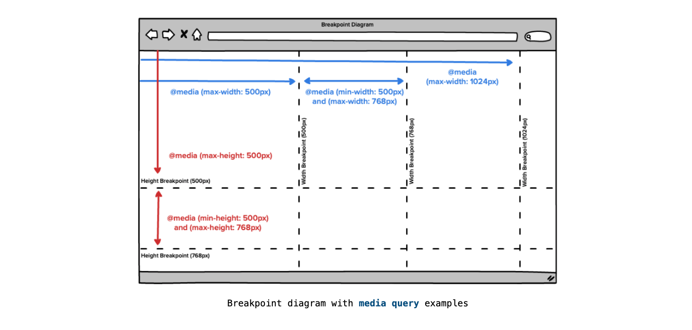
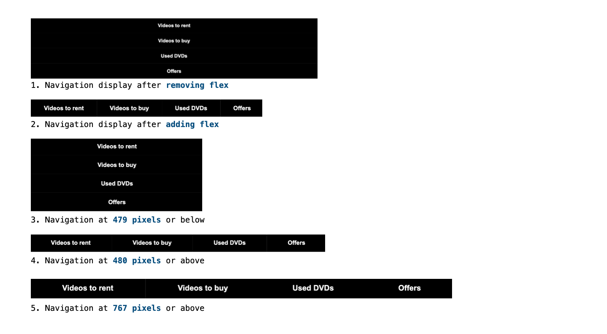
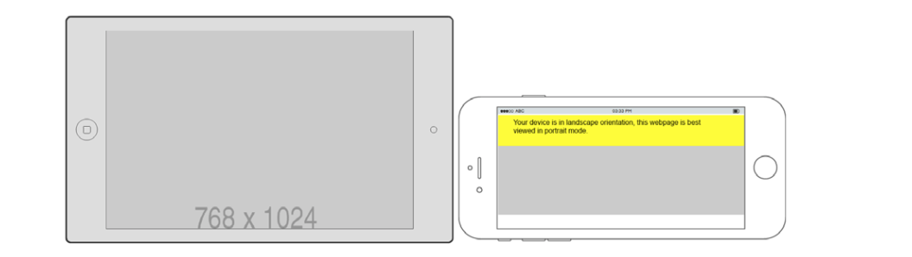
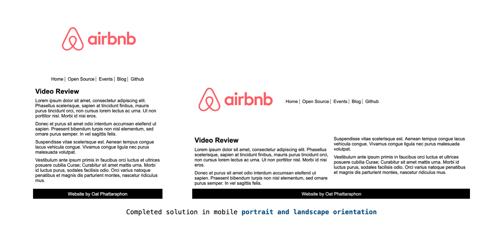
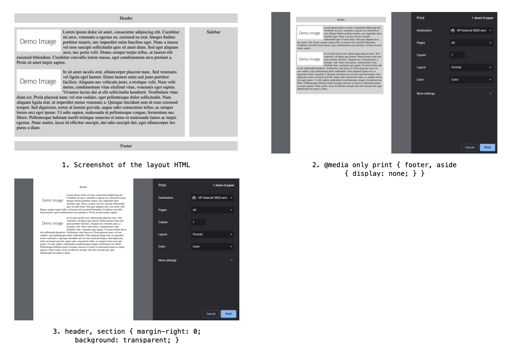

# Chapter 6: Responsive Web Design and Media Queries

## **Table Content**

[Mobile-First](#Mobile-First)

- [Responsive Web Design](#Responsive-Web-Design)
- [Responsive Viewport](#Responsive-Viewport)
- [Understanding Basic Media Queries](#Understanding-Basic-Media-Queries)
- [Exercise 6.01: Using Media Queries to Change the Page Layout](#Exercise-6.01:-Using-Media-Queries-to-Change-the-Page-Layout)
- [Device Orientation Media Queries](#Device-Orientation-Media-Queries)
- [Exercise 6.02: Using Media Queries to Detect Device Orientation](#Exercise-6.02:-Using-Media-Queries-to-Detect-Device-Orientation)
- [Combining Multiple Media Queries](#Combining-Multiple-Media-Queries)
- [Print Stylesheets](#Print-Stylesheets)
- [Exercise 6.03: Generating a Printable Version of a Web Page Using CSS Media Queries](#Exercise-6.03:-Generating-a-Printable-Version-of-a-Web-Page-Using-CSS-Media-Queries)
- [Activity 6.01: Refactoring the Video Store Product Cards into a Responsive Web Page](#Activity-6.01:-Refactoring-the-Video-Store-Product-Cards-into-a-Responsive-Web-Page)

## **Mobile-First**

### Responsive Web Design

### Responsive Viewport

- `width`
- `device-width`
- `initial-scale`
- `maximum-scale`

  ```html
  <!DOCTYPE html>
  <html lang="en">
    <head>
      <meta charset="UTF-8" />
      <meta name="viewport" content="width=device-width, initial-scale=1.0" />
      <title>Web Responsive</title>
    </head>
    <body>
      <h1>HTML and CSS</h1>
      <p>How to create a modern, responsive website with HTML and CSS</p>
    </body>
  </html>
  ```

### Understanding Basic Media Queries

- `@media`
- `@media only screen and (max-width: 768[x])`

  

  ```css
  /* 0-768px is blue color */
  @media only screen and (max-width: 768px) {
    p {
      color: blue;
    }
  }
  ```

  

  ```css
  /* 769 up is a red color */
  @media only screen and (min-width: 769px) {
    p {
      color: red;
    }
  }
  ```

  

  ```css
  /* between 480-768 is a purple color */
  @media only screen and (min-width: 480px) and (max-width: 768px) {
    p {
      color: purple;
    }
  }
  ```

  

  ```css
  /* height 500 up background-color is pink */
  @media only screen and (min-height: 500px) {
    body {
      background-color: pink;
    }
  }
  ```

  

### _Exercise 6.01: Using Media Queries to Change the Page Layout_



### Device Orientation Media Queries

- `@media (orientation: landscape)`
- `@media (orientation: portrait)`

  ```html
  <!-- Example 6.01 -->
  <html>
    <head>
      <meta name="viewport" content="width=device-width, initial-scale=1" />
      <style type="text/css">
        p.warning {
          display: none;
          background: yellow;
          padding: 10px;
          font-size: 25px;
          margin: 0;
        }

        @media (orientation: landscape) {
          p.warning {
            display: block;
          }
        }
        img {
          width: 100%;
          height: auto;
        }
      </style>
    </head>
    <body>
      <p class="warning">
        Your device is in landscape orientation, this webpage is best viewed in
        portrait mode.
      </p>
      
    </body>
  </html>
  ```

  ```css
  @media (orientation: landscape) and (min-width: 400px) and (max-width: 768px);
  ```

  

  > _Orientation warning demo on a tablet and mobile device_

  ```html
  <html>
    <head>
      <meta name="viewport" content="width=device-width, initial-scale=1" />
      <style type="text/css">
        p.warning {
          display: none;
          background: yellow;
          padding: 10px;
          font-size: 25px;
          margin: 0;
        }

        @media (orientation: landscape) and (min-width: 400px) and (max-width: 768px) {
          p.warning {
            display: block;
          }
        }
        img {
          width: 100%;
          height: auto;
        }
      </style>
    </head>
    <body>
      <p class="warning">
        Your device is in landscape orientation, this webpage is best viewed in
        portrait mode.
      </p>
      
    </body>
  </html>
  ```

### _Exercise 6.02: Using Media Queries to Detect Device Orientation_



### Combining Multiple Media Queries

```css
/*
    width: 0-319 is pink color
    width: 320-480 is red color
    width: 481-1279 is pink color
    width: 1280 up is red color
*/
@media screen and (max-width: 480) and (min-width: 320), (min-width: 1280px) {
  body {
    background: red;
  }
}
```


### Print Stylesheets

- `<link />`
- `@media`

  ```css
  <link rel="stylesheet" media="print" href="print.css" />
  ```

### _Exercise 6.03: Generating a Printable Version of a Web Page Using CSS Media Queries_



### _Activity 6.01: Refactoring the Video Store Product Cards into a Responsive Web Page_

<!-- CONTACT -->

## Contact

Oat Phattaraphon - [@phattaraphon_c](https://twitter.com/phattaraphon_c)
