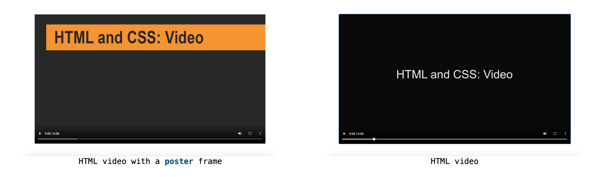
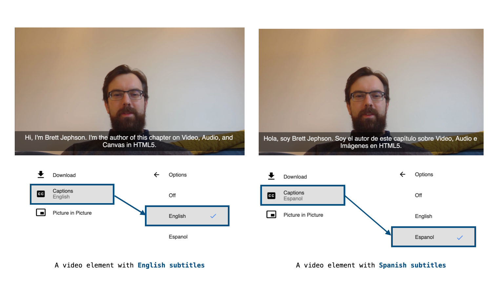
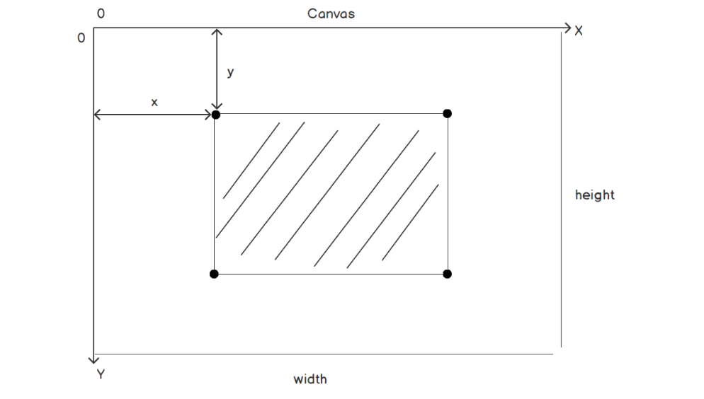
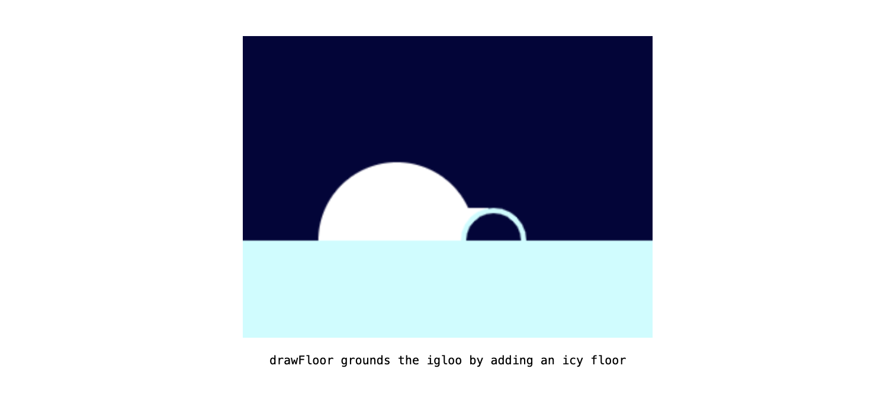
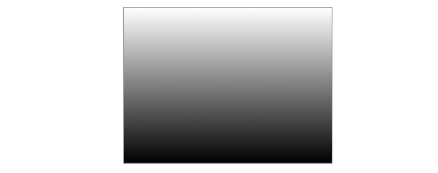
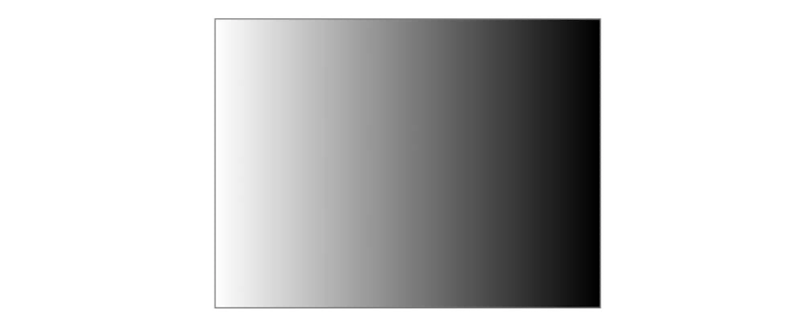
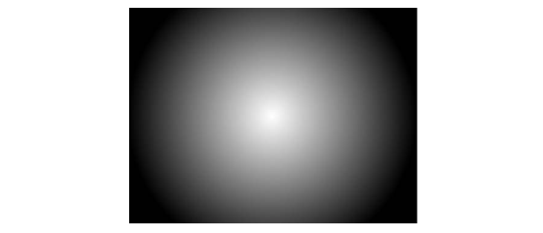
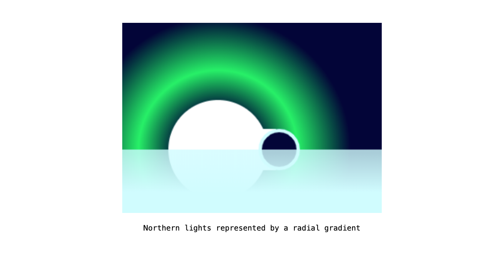
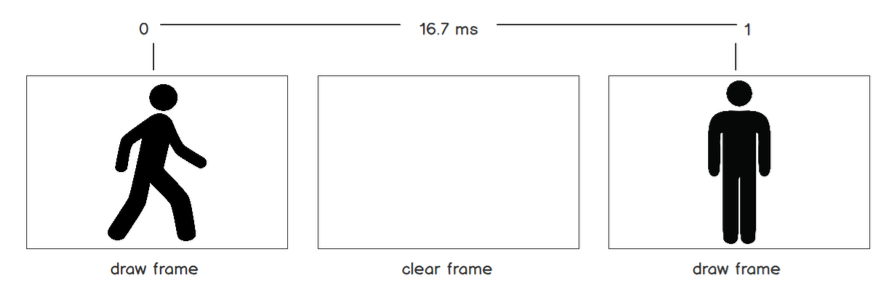
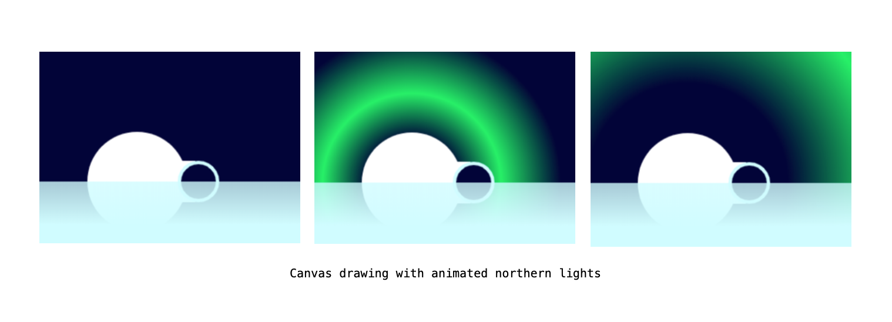

# **Chapter 7 : Media - Audio Video and Canvas**

[Introduction](#Introduction)
[Audio](#Audio)

- [Exercise 7.01: Adding Audio to a Web Page](#Exercise-7.01:-Adding-Audio-to-a-Web-Page)
- [Attributes](#Attributes)
  - [The Autoplay Attribute](#The-Autoplay-Attribute)
  - [The preload Attribute](#The-preload-Attribute)
  - [The loop Attribute](#The-loop-Attribute)
  - [The controls Attribute](#The-controls-Attribute)
- [Styling Audio Controls](#Styling-Audio-Controls)
- [Exercise 7.02: Styling Controls](#Exercise-7.02:-Styling-Controls)
- [Multiple Sources](#Multiple-Sources)

[The video Element](#The-video-Element)

- [Attributes](#Attributes)
  - [The width and height Attributes](#The-width-and-height-Attributes)
  - [The poster Attribute](#The-poster-Attribute)
- [Exercise 7.03: Adding Video to a Web Page](#Exercise-7.03:-Adding-Video-to-a-Web-Page)

[Limitations](#Limitations)

[The track Element](#The-track-Element)

- [Adding Subtitles](#Adding-Subtitles)
- [Exercise 7.04: Adding Subtitles](#Exercise-7.04:-Adding-Subtitles)

[Images](#Images)

- [The img Element](#The-img-Element)
- [The picture Element](#The-picture-Element)
- [Programmable Graphics](#Programmable-Graphics)
  - [The svg Element](#The-svg-Element)
  - [The canvas Element](#The-canvas-Element)
    - [Checking for canvas Support](#Checking-for-canvas-Support)
    - [Drawing in canvas](#Drawing-in-canvas)
    - [The canvas Grid](#The-canvas-Grid)
    - [Drawing a Rectangle](#Drawing-a-Rectangle)
    - [Drawing a Circle](#Drawing-a-Circle)
    - [Clearing the canvas](#Clearing-the-canvas)
- [Exercise 7.05: Drawing Shapes](#Exercise-7.05:-Drawing-Shapes)
- [Drawing Other Shapes](#Drawing-Other-Shapes)

[Gradients](#Gradients)

- [Exercise 7.06: Gradients](#Exercise-7.06:-Gradients)

[Animating a Canvas](#Animating-a-Canvas)

- [Exercise 7.07: Animated canvas](#Exercise-7.07:-Animated-canvas)
- [Activity 7.01: Media Page](#Activity-7.01:-Media-Page)

[Summary](#Summary)

## **Introduction**

## **Audio**

`audio`, `src`, `source`

```html
<audio controls src="media/track1.mp3">
  It looks like your browser does not support <code>audio</code>.
</audio>
```


- ### _Exercise 7.01: Adding Audio to a Web Page_

  

- ### Attributes

  The following attributes can be used to modify the **`audio`** element

  - `autoplay`
  - `preload`
  - `loop`
  - `controls`

- #### The Autoplay Attribute

  - `controls`

- #### The preload Attribute

  - `none` The audio will not be preloaded.
  - `metadata` The browser will load audio metadata but not the whole file.
  - `auto` This is the same as an empty string; that is, `preload=""` – the whole audio file will be downloaded.

- #### The loop Attribute

  - `loop`

- #### The controls Attribute

  The `controls` attribute adds the default media controls for the browser. This allows a user to control the playback of audio. While the browser's media playback UI shares many common features (volume, mute toggle, and scrub bar, to name a few)

- ### Styling Audio Controls

  The default controls provide a lot of functionality for free. They may well be all that you need. However, as you've seen, the styles are different for each browser and may not fit with your own design or requirements. The best option for customizing the controls is to not set the `controls` attribute and to create your own custom controls with HTML, CSS, and a little bit of JavaScript.

- ### _Exercise 7.02: Styling Controls_

  

- ### Multiple Sources

  > You can learn more about media formats and browser compatibility from MDN at https://packt.live/33s2I6V

  ```html
  <audio controls>
    <source src="media/track1.webm" type="audio/webm" />
    <source src="media/track1.mp3" type="audio/mpeg" />
    <source src="media/track1.ogg" type="audio/ogg" />
    It looks like your browser does not support <code>audio</code>.
  </audio>
  ```

## **The video Element**

- ### Attributes

  - `height`
  - `width`
  - `poster`

  - #### The width and height Attributes
    The `width` and `height` attributes set the width and height of the video display area, respectively. Both values are measured in absolute pixel values – in other words, the values must be non-negative integers and they cannot be percentages.
  - #### The poster Attribute
    The `poster` attribute allows you to provide the source for an image that will be shown while the video is being downloaded. If we do not set the `poster` attribute, a blank square will appear until the first frame of the video has been downloaded, and then the first frame of the video will show in place of the poster image.

- ### _Exercise 7.03: Adding Video to a Web Page_

  

## **Limitations**

> You can learn more about various restrictions and policies from the browser vendors from a variety of sources. For example, good information about Safari and iOS can be found here: https://packt.live/2CivkDQ.
> Information on autoplay in Chrome can be found here: https://packt.live/2qrGTWH.

## **The track Element**

`track`, `media`, `source`

The following attributes let you modify a track element

- `scr`The location of the external file with the text track.
- `default` One `track` element per `media` element can be set as the default track. This attribute acts as an indication and it may be overridden by user settings (such as language).
- `kind` Specifies how the text track is supposed to be used. There are several options, including

  - `subtitles`
  - `captions`
  - `descriptions`
  - `chapters`
  - `metadata`
  - The default value is `subtitles`

- `srclang` The language of the track text; for instance
  - `en` for English
  - `fr` for French. If the track is a subtitle track, then `srclang` is required.
- `label` A human-readable title that's used to differentiate between captions and subtitles.

```html
<track src="media/track1-en.vtt" kind="subtitles" label="English subtitles" />
<track src="media/track1-sparse.vtt" kind="captions" label="Sparse captions" />
<track src="media/track1-full.vtt" kind="captions" label="Full captions" />
```


- ### Adding Subtitles

  `Web Video Text Tracks Format (WebVTT)`, `--> string`

  ```html
  <!-- WEBVTT -->

  00:00:01.000 --> 00:00:05.000 First subtitle text <br />
  00:00:10.000 --> 00:00:25.000 Second subtitle text
  ```

- ### _Exercise 7.04: Adding Subtitles_

  

## **Images**

The approaches we will look at for embedding images in a web page are

- `img`
- `picture`
- Programmable graphics

- ### The img Element

  `img`, `alt`

  ```html
  
  ```

- ### The picture Element

  `picture`, `type`, `mime`

  ```html
  <!-- width: 0-639px show poster-small but 800up show poster-large -->
  <picture>
    <source srcset="media/poster-small.png" media="(max-width: 639px)" />
    <source srcset="media/poster-large.png" media="(min-width: 800px)" />
    
  </picture>
  ```

- ### Programmable Graphics

  As well as loading and embedding rasterized image files, such as `.jpeg`, `.gif`, `.png`, and `.webp`, on a web page, there are some options for creating graphics programmatically

  - `Scalable vector graphics (SVG)` is an `XML-based` format for creating vector graphics on web pages.
  - The `canvas` element gives you access to a `JavaScript` drawing API that you can use to create rasterized graphics on a web page.

- #### The svg Element

  ```xml
  <svg viewBox="0 0 100 100" xmlns="http://www.w3.org/2000/svg" width="100" height="100">
  <circle cx="50" cy="50" r="48" fill="#4717F6" />
  <path d="M 85,50 25,75 25,25 z" fill="white" /> </svg>
  ```

  

- #### The canvas Element

  - ##### Checking for canvas Support

    ```html
    <canvas id="canvasArea" width="320" height="240">
      Your browser does not support the <code>canvas</code> element.
    </canvas>
    ```

    ```javascript
    const canvasElement = document.getElementById('canvasArea'); if (canvasElement.getContext) {
    const context = canvasElement.getContext('2d'); // we have a context so we can draw something
    } </script>
    ```

  - ##### Drawing in canvas
  - ##### The canvas Grid

    `canvas`, `width`, `height`

    

    > canvas coordinate system

  - ##### Drawing a Rectangle

    `fillRect`, `fillStyle`, `strokeStyle`, `lineWidth`, `StrokeRect`, `fill`, `stroke`

    ```js
    context.fillStyle = "red";
    context.fillRect(50, 50, 150, 100);
    ```

    

    > fillRect used to draw a red rectangle on the canvas 320x240 pixels

    ```js
    context.strokeStyle = "red";
    context.lineWidth = 4;
    context.strokeRect(50, 50, 150, 100);
    ```

    

    > strokeRect used to draw a rectangle with a border on the canvas

    ```js
    context.fillStyle = "blue";
    context.strokeStyle = "orange";
    context.lineWidth = 4;
    context.rect(50, 50, 150, 100);
    context.fill();
    context.stroke();
    ```

    

    > Fill and stroke used to draw a rectangle with a border and fill on the canvas

  - ##### Drawing a Circle

    `arc`, `true`, `false`

    ```js
    context.fillStyle = "red";
    context.arc(50, 50, 25, 0, Math.PI * 2, false);
    context.fill();
    ```

    

    > Fill used to draw a red circle on the canvas

  - ##### Clearing the canvas

    `clearRect`, `canvas`, `canvasElement`

    ```js
    context.clearRect(0, 0, canvasElement.width, canvasElement.height);
    ```

- ### _Exercise 7.05: Drawing Shapes_

  

- ### Drawing Other Shapes

  - `moveTo`
  - `lineTo`
  - `beginPath`

    ```js
    context.fillStyle = "yellow";
    context.beginPath();
    context.moveTo(160, 60);
    context.lineTo(220, 120);
    context.lineTo(100, 120);
    context.lineTo(160, 60);
    context.fill();
    context.beginPath();
    context.moveTo(160, 140);
    context.lineTo(220, 80);
    context.lineTo(100, 80);
    context.lineTo(160, 140);
    context.fill();
    ```

    

    > A star shape created on the canvas with the moveTo and lineTo commands

## **Gradients**

We can create two types of gradients

- `Linear`
- `Radial`
- `createLinearGradient`
- `createRadialGradient`

  ```js
  const gradient = context.createLinearGradient(0, 0, 0, canvasElement.height);
  gradient.addColorStop(0, "white");
  gradient.addColorStop(1, "black");
  ```

  ```js
  context.fillStyle = gradient;
  context.fillRect(0, 0, canvasElement.width, canvasElement.height);
  ```

  

  > A top to bottom linear gradient from white to black

  ```js
  const gradient = context.createLinearGradient(0, 0, canvasElement.width, 0);
  ```

  

  > A left to right linear gradient from white to black

  ```js
  const gradient = context.createRadialGradient(
    canvasElement.width * 0.5,
    canvasElement.height * 0.5,
    1,
    canvasElement.width * 0.5,
    canvasElement.height * 0.5,
    canvasElement.width * 0.5
  );
  gradient.addColorStop(0, "white");
  gradient.addColorStop(1, "black");
  ```

  

  > A radial gradient from white to black

- ### _Exercise 7.06: Gradients_

  

## **Animating a Canvas**

- `clearRect`
- `width`
- `height`
- `canvas`
- `canvasArea`
- `setInterval`
- `setTimer`
- `requestAnimationFrame`

  

  ```js
  const canvasElement = document.getElementById('canvasArea');
  const context = canvasElement.getContext('2d);
  context.clearRect(0, 0, canvasElement.width, canvasElement.height);
  ```

  ```js
  function drawFrame(context) {
    // first, we clear the canvas
    context.clearRect(0, 0, canvasElement.width, canvasElement.height); // ...draw something in our canvas
    // finally, request the next frame
    requestAnimationFrame(function () {
      drawFrame(context);
    });
  }
  drawFrame(context);
  ```

- ### _Exercise 7.07: Animated canvas_

  

- ### _Activity 7.01: Media Page_

## **Summary**
