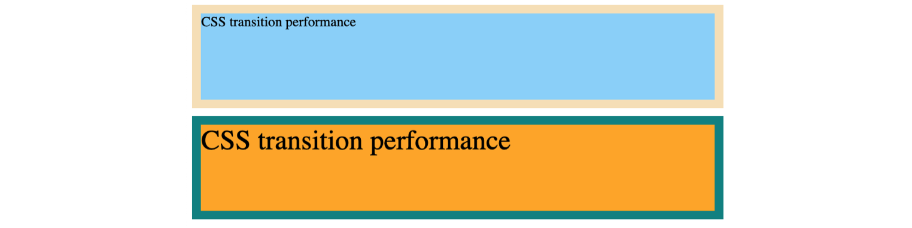
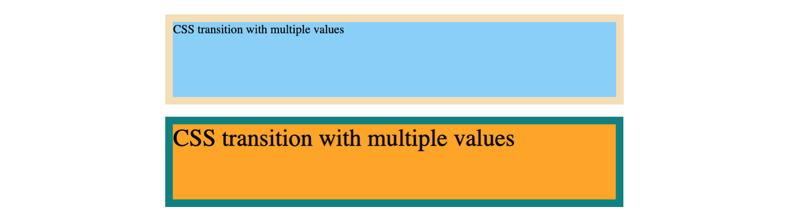
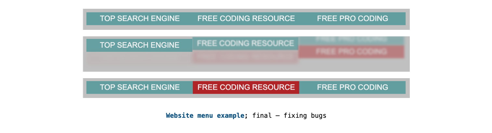
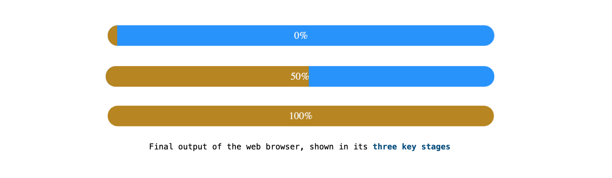
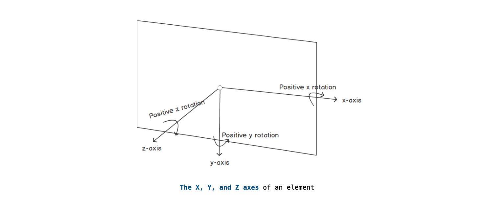

# Chapter 8: Animations

## Table Contents

[CSS Transitions](#CSS-Transitions)

- [Exercise 8.01: Implementing Our First Simple Animation](#Exercise-8.01:-Implementing-Our-First-Simple-Animation)
- [Exercise 8.02: Enhanced Control in CSS Transitions](#Exercise-8.02:-Enhanced-Control-in-CSS-Transitions)
- [Exercise 8.03: CSS Transition Performance](#Exercise-8.03:-CSS-Transition-Performance)
- [Exercise 8.04: CSS Transition with Multiple Values](#Exercise-8.04:-CSS-Transition-with-Multiple-Values)
- [Advanced CSS for Animations](#Advanced-CSS-for-Animations)

  - [CSS Positioning](#CSS-Positioning)
  - [Overflow](#Overflow)
  - [Opacity](#Opacity)
  - [Blur](#Blur)
  - [Inserting Content with attr](#Inserting-Content-with-attr)

[Exercise 8.05: Animating a Website Menu](#Exercise-8.05:-Animating-a-Website-Menu)

[Transition Duration Sweet Spot](#Transition-Duration-Sweet-Spot)

[Slowing Animations Down](#Slowing-Animations-Down)

[Animation Acceleration and Deceleration](#Animation-Acceleration-and-Deceleration)

[Keyframe Animations in CSS](#Keyframe-Animations-in-CSS)

[Using the CSS Animation Property](#Using-the-CSS-Animation-Property)

[Exercise 8.06: CSS Preloader Using Keyframes](#Exercise-8.06:-CSS-Preloader-Using-Keyframes)

[More CSS Tips and Tricks](#More-CSS-Tips-and-Tricks)

- [Activity 8.01: Animating Our Video Store Home Page](Activity-8.01:-Animating-Our-Video-Store-Home-Page)

[Summary](#Summary)

## **CSS Transitions**

- `transition-duration`
- `transition-property`
- `transition-delay`

  ```css
  p {
    transition: 250ms;
  }
  p:hover {
    background-color: darkolivegreen;
    color: white;
  }
  ```

  ```html
  <p>This is a very simple example of a transition</p>
  ```

  

* ### _Exercise 8.01: Implementing Our First Simple Animation_

  

* ### _Exercise 8.02: Enhanced Control in CSS Transitions_

  

* ### _Exercise 8.03: CSS Transition Performance_

  

* ### _Exercise 8.04: CSS Transition with Multiple Values_

  

- ### Advanced CSS for Animations

  - #### CSS Positioning

    - `position`
    - `top`
    - `left`
    - `bottom`
    - `right`
    - `position: relative`
    - `position: absolute`

    

  - #### Overflow

    ```css
    overflow: hidden;
    overflow: visible;
    ```

    

  - #### Opacity

    ```css
    opacity: 1;
    opacity: 0.5;
    opacity: 0;
    ```

    

  - #### Blur

    ```css
    filter: blur(5px);
    ```

    

  - #### Inserting Content with attr

    - `:before`
    - `:after`
    - `attr()`

    ```html
    <a class="selector" title="Content Here Will Appear In :before"
      >Selector Text</a
    >
    ```

    ```css
    .select:before {
      content: attr(title);
    }
    ```

## **_Exercise 8.05: Animating a Website Menu_**



## **Transition Duration Sweet Spot**

## **Slowing Animations Down**

In Chrome, follow these steps to get to the interface that allows you to slow down the animations:

1. Click the **triple vertical dots** that you can find at the far top right of the Chrome browser.
2. Select **More tools.**
3. Select **Developer tools.**
4. Find the **three vertical dots** in the developer tools and click on it.
5. Select **More tools.**
6. Select **Animations.**

_A better way to do this is to remember the shortcut and press CTRL + SHIFT + i on Windows, or ALT + CMD + i on a Mac._

## **Animation Acceleration and Deceleration**

- `transition-timing-function: ease`

  ```css
  .top-navigation-link:before,
  .top-navigation-link:after {
    transition-timing-function: ease;
  }
  ```

- `cubic-bezier`

  ```css
  transition-timing-function: cubic-bezier(0.93, 0.45, 0.73, 1.3);
  ```

## **Keyframe Animations in CSS**

- `@keyframes`
- `animationName`

  ```css
  @keyframes animationName {keyframes-selector {css-styles}}
  ```

  ```css
  @keyframes showHide {
    0% {
      opacity: 0;
    }
    100% {
      opacity: 1;
    }
  }
  ```

## **Using the CSS Animation Property**

- `ease-in-out`
- `push-ease-off`
- `steps()`

  ```css
  animation: name duration timing-function delay iteration-count direction
    fill-mode;
  ```

  ```css
  animation: rotateBall 3s infinite;
  ```

## **_Exercise 8.06: CSS Preloader Using Keyframes_**



## **More CSS Tips and Tricks**

- `text-align: center`
- `scale`
- `scaleY`
- `scaleX`
- `scaleZ`
- `scale3d`

  ```css
  margin: 0 auto;
  ```

  ```css
  transform: scale3d(1.1, 1.1, 1.1);
  ```

  ```css
  animation-timing-function: cubic-bezier(0.2, 0.61, 0.35, 1);
  ```

  ```css
  animation-play-state: paused;
  ```

  ```css
  animation-play-state: running;
  ```

  

- ### _Activity 8.01: Animating Our Video Store Home Page_

## **Summary**
