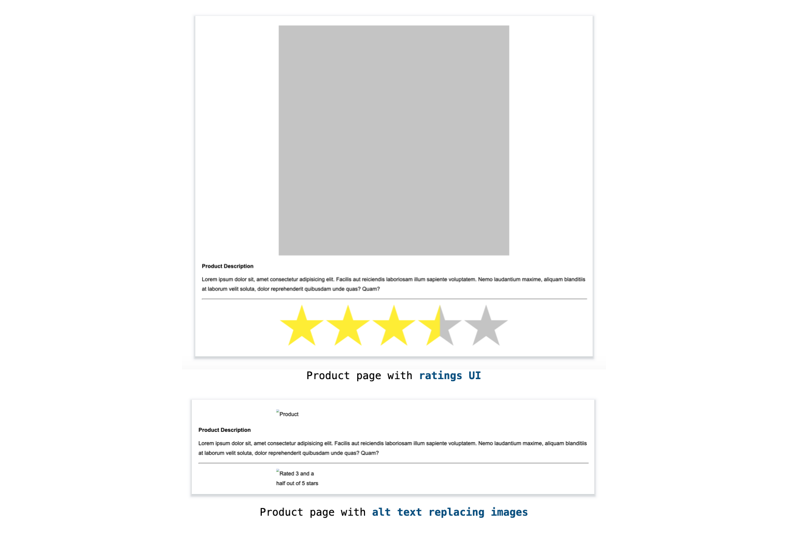
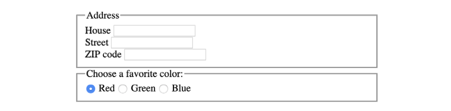
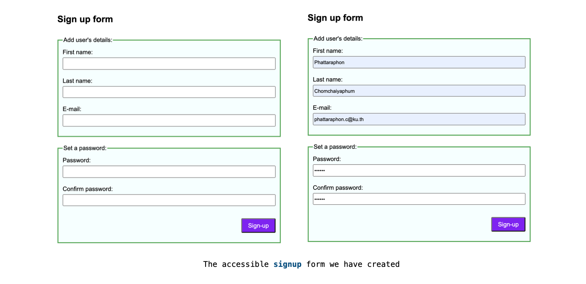
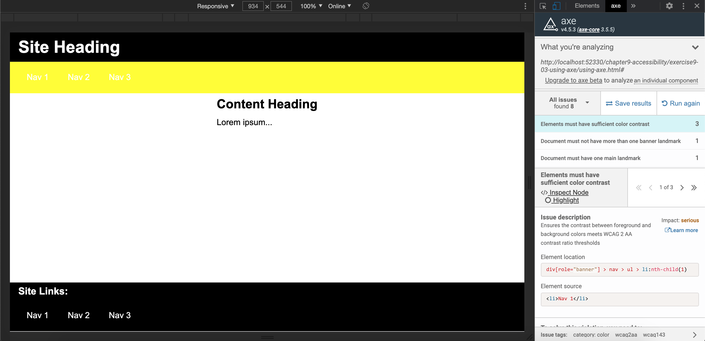
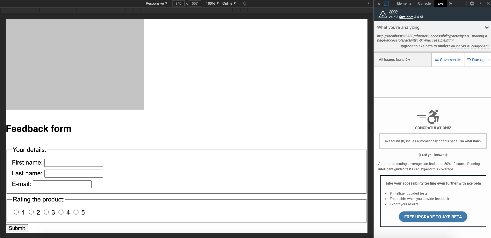

# Chapter 9: Accessibility

## Table Content

[What Is Accessibility?](#What-Is-Accessibility?)

[Accessible Images](#Accessible-Images)

- [Exercise 9.01: Accessible Ratings](#Exercise-9.01:-Accessible-Ratings)

[Semantic HTML](#Semantic-HTML)

[Accessible Forms](#Accessible-Forms)

- [Exercise 9.02: Accessible Signup Form](#Exercise-9.02:-Accessible-Signup-Form)

[Keyboard Accessibility](#Keyboard-Accessibility)

[Accessible Motion](#Accessible-Motion)

[Accessibility Tools](#Accessibility-Tools)

- [Axe Tool](#Axe-Tool)
- [Exercise 9.03: Using Axe](#Exercise-9.03:-Using-Axe)
- [Activity 9.01: Making a Page Accessible](#Activity-9.01:-Making-a-Page-Accessible)

[Summary](#Summary)

## What Is Accessibility?

Accessibility is a very important subject for the web and web developers, but it is one that isn't always that well understood. By learning about the accessibility improvements we will look at in this chapter, we can help a lot of users. We can remove barriers for the following

- Those with visual impairments who cannot get information from images that do not have a text alternative

- People who have hearing impairments and cannot get information from media (audio or video)

- Those with physical impairments that prevent them from using a mouse

## Accessible Images

```html

```

```html
<div class="rating">
  
  
  
  
  
</div>
```

- ### _Exercise 9.01: Accessible Ratings_

  

## Semantic HTML

- `section`
- `header`
- `footer`
- `main`
- `aside`
- `nav`

## Accessible Forms

The techniques we will look at here are as follows

- `Labels and input fields`
- `Fieldset`
- `label` + `input`

  ```html
  <label for="first-name">First name</label>
  <input type="text" id="first-name" />
  ```

  ```html
  <label>First name: <input type="text" /></label>
  ```

  ```html
  <form>
    <fieldset>
      <legend>Provide your address:</legend>
      <label for="house">House</label> <input type="text" id="house" />
      <br />
      <label for="street">Street</label>
      <input type="text" id="street" />
      <br />
      <label for="zipcode">ZIP code</label>
      <input type="text" id="zipcode" />
    </fieldset>
    <fieldset>
      <legend>Choose a favorite color:</legend>
      <input type="radio" value="red" id="red" name="color" />
      <label for="red">Red</label>
      <input type="radio" value="green" id="green" name="color" />
      <label for="green">Green</label>
      <input type="radio" value="blue" id="blue" name="color" />
      <label for="blue">Blue</label>
    </fieldset>
  </form>
  ```

  

- ### _Exercise 9.02: Accessible Signup Form_

  

## Keyboard Accessibility

We can navigate through a web page using the following keys on the keyboard

- `Tab`
- `Shift + Tab`
- `Enter`

## Accessible Motion

```html
<div class="animation">animated box</div>
```

```css
.animation {
  position: absolute;
  top: 150px;
  left: 150px;
}
@media (prefers-reduced-motion: no-preference) {
  .animation {
    animation: moveAround 1s 0.3s linear infinite both;
  }
}
@keyframes moveAround {
  from {
    transform: translate(-50px, -50px);
  }
  to {
    transform: translate(50px, 100px);
  }
}
```

## Accessibility Tools

- ### Axe Tool

  To install the Axe extension, we can go to the Chrome web store at https://packt.live/2WSY7Iz

- ### _Exercise 9.03: Using Axe_

  

- ### _Activity 9.01: Making a Page Accessible_

  

## Summary
